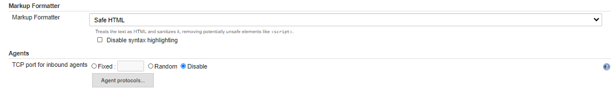

1.0 Host set up

Update /etc/hosts file with all host name

> vi /etc/hosts
>
> 10.0.1.x ip-10.0.1.x
>
> 10.0.3-x ip-10-0-3-x
>
> 10.0-3-x ip-10-0-3-x
>
> 10-0-3-x ip-10-0-3-x
>
> 10-0-3-x ip-10-0-3-x
>
> 10-0-1-x ip-10-0-1-x
>
> 10-0-1-x ip-10-0-1-x
>
> 10-0-3-x ip-10-0-3-x
>
> 10-0-3-x ip-10-0-3-x
>
> 10-0-3-x ip-10-0-3-x
>
> 10-0-3-x ip-10-0-3-x
>
> In “FS-Core-db” server, except Core Db Host name add all names in host
> file

1.1 Jenkins Setup – First Run

-   SSH to the Jenkins server

> git clone <https://github.com/project-sunbird/sunbird-devops.git>
>
> cd sunbird-devops && git checkout tags/release-1.14.0 -b
> release-1.14.0
>
> cd deploy/Jenkins
>
> Note: Edit jenkins-server-setup.sh to update the version of jenkin to
> 2.204
>
> sudo bash jenkins-server-setup.sh

-   Once the jenkins-server-setup.sh script completes, open jenkins in
    > browser by typing domain-name:8080 / public-ip:8080

> Enter the initial password. Follow the on screen instructions

-   Choose install suggested plugin

> Create a admin user
>
> User name: admin
>
> Password: &lt;initial password&gt;
>
> Email : &lt;communication email&gt;

-   Choose the default jenkins URL. You can either change this to your
    > domain name or public IP. If in doubt, just use whatever is
    > displayed on screen as this can be changed later if required in
    > Jenkins configuration.

> [*http://IP:8080/*](http://ip:8080/)

-   switch back to the terminal session on the Jenkins server

> sudo bash jenkins-plugins-setup.sh\
> Enter the URL as localhost:8080\
> Enter the admin username and password

-   Now go to Manage Jenkins -&gt; Manage Plugins -&gt; Update Center
    > -&gt; Check status of plugin install. If any plugins failed to
    > install, install them manually by visiting the plugins section of
    > Jenkins

<!-- -->

-   Now switch back to the terminal session on the Jenkins server

> cp envOrder.txt.sample envOrder.txt\
> vi envOrder.txt

-   Update the environment list as per your infrastructure in ascending
    > order. For example if you have only dev and production,
    > your envOrder.txt will look like

> dev=0
>
>  production=1

-    Now run the jenkins-jobs-setup.sh script

> sudo bash jenkins-jobs-setup.sh

-   Follow the onscreen instruction of the script. Provide choice as
    > “yes” for all questions. The options are case sensitive, the
    > script will display the accepted options.

<!-- -->

-   Once the script completes copying the job config, go to the browser
    > and restart jenkins using public-ip:8080/restart OR
    > domain-name:8080/restart

<!-- -->

-   Go
    > to http://&lt;jenkins\_domain&gt;/credentials/store/system/domain/\_/newCredentials\
    > Select Username with Password

<!-- -->

-   Enter the username and password of the github account where the
    > private repo will be hosted.

> Enter a unique long string for the ID field such as private-repo-creds
>
> you can provide the description as private repo credentials and click
> OK.

-   Goto *http://&lt;jenkins\_domain&gt;/configure*

<!-- -->

-   Choose the check box named “Environment variables”

<!-- -->

-   Click on Add and enter the following Name, Value pairs

 | Name         |                  Value|
  --------------|:------------------------:|
 | ANSIBLE\_FORCE\_COLOR    |      true |
 | ANSIBLE\_HOST\_KEY\_CHECKING |  false |
 | ANSIBLE\_STDOUT\_CALLBACK   |  debug |
 | hub\_org                  |     docker hub organization / username eg: In sunbird/player image, sunbird is the hub\_org |
 | private\_repo\_branch       |   The branch name in the private repository which you would like to use. This branch will have the inventory and secrets |
 | private\_repo\_credentials    | The unique string which you provided for ID field while entering the github repo credentials. eg: private-repo-creds |
 | private\_repo\_url          |   The github URL to your private repo. You can visit your private repo and click on clone button, which will display the https URL to your private repository. Only https URL is currently supported.|
 | public\_repo\_branch        |   This is the branch or tag from where Jenkinsfile will be picked up. You can set this value as refs/tags/release-1.14.0 if you want to build from tags or provide the value of development branch like release-1.15 (not recommended since development branches are not stable). |

-   Scroll down to “Global Pipeline Libraries” section and click Add.
    > Provide the values as below

 | Name          |           Value |
  ----------------|:-------- ----------:|
 |  Library Name        |     deploy-conf |
 | Default version       |   Tag name of the jenkins shared library. This should be same version of the release you are going to build and deploy. For example, if you decide to use tags release-1.14.0 as your base, jenkins shared library tag will be release-1.14.0-shared-lib. When you upgrade to tags release-1.15.0, this value should get changed to release-1.15.0-shared-lib|
| Retrieval method     |    Modern SCM |
| Source Code Management  | Git |
 | Project Repository    |   <https://github.com/project-sunbird/sunbird-devops.git> |

-   Click on Save and go to Manage Jenkins -&gt; Configure global
    > security

<!-- -->

-   Choose the “Markup Formatter” as “Safe HTML”

-   Go to Manage Jenkins -&gt; Manage Nodes -&gt; Click master -&gt;
    > Click Configure -&gt; Provide labels as “build-slave”

<!-- -->

-   Set the number of executors to a number like 15 if your system
    > configuration is 16 GB RAM and 4 core CPU. Adjust this number
    > accordingly based on your system configuration

-   Switch back to the terminal session on Jenkins server

<!-- -->

-   Restart jenkins by running sudo service jenkins restart

<!-- -->

-   Execute below command to create SSH config file

> sudo su jenkins
>
> mkdir -p /var/lib/jenkins/secrets && cd /var/lib/jenkins/secrets
>
> touch deployer\_ssh\_key ops\_ssh\_key vault-pass
>
> chmod 400 deployer\_ssh\_key ops\_ssh\_key vault-pass
>
> 

-   The key which you used to login to the Jenkins server will be called
    > as ops\_ssh\_key from now onwards. Example

> ssh -i somekey.pem ubuntu@jenkins-server-ip
>
> Here somekey.pem is the key you used to login to the Jenkins server
> which will be called as ops\_ssh\_key

-   Copy the contents of the key you used to connect to VM
    > into ops\_ssh\_key file

<!-- -->

-   Create a new ssh key on your local machine or any server. We will
    > use this for a user named deployer (or any name you like)

>  ssh-keygen -f deployer\_ssh\_key (passphrase should be empty)

-   Copy the contents of the deployer\_ssh\_key into
    > /var/lib/jenkins/secrets/deployer\_ssh\_key

<!-- -->

-   If your github private repo consists of ansible encrypted files,
    > then enter the decryption password

> in /var/lib/jenkins/secrets/vault-pass. If there are no encrypted
> files, then enter some random value like 12345 into
> the vault-pass file. This file cannot be empty.

-   Restart Jenkins server

<!-- -->

-   Follow the next set of steps to create inventory, secrets and
    > ansible hosts in the private repo.

> Updating private repo with hosts and variables

a.  git clone [https://github.com/project-sunbird/sunbird-devops](https://project-sunbird/sunbird-devops)

b.  cd sunbird-devops && git checkout tags/release-1.14.0 -b
    > release-1.14.0

c.  cp -rf sunbird-devops/private\_repo .

d.  cd private\_repo

e.  Folder Structure for the private directory which contains ansible
    > hosts secrets and variables.

> Folder Structure

  -----------------------------------------------------
  > \~/Documents/projects/subird-devops/private\_repo
  >
  > ansible
  >
  > └── inventory
  >
  >     └── dev
  >
  >         ├── Core
  >
  >         │   ├── common.yml
  >
  >         │   ├── hosts
  >
  >         │   └── secrets.yml
  >
  >         ├── DataPipeline
  >
  >         │   ├── common.yml
  >
  >         │   ├── hosts
  >
  >         │   └── secrets.yml
  >
  >         └── KnowledgePlatform
  >
  >             ├── common.yml
  >
  >             ├── hosts
  >
  >             └── secrets.yml
  >
  >  
  >
  > 5 directories, 9 files
  -----------------------------------------------------

a.  git init

b.  git add .

c.  git commit -m"Creating private files"

d.  git remote add origin &lt;private repo url&gt;

e.  git branch --set-upstream-to=origin/master master && git push
    > --set-upstream origin master

f.  update the variables and push it to upstream.

> Updating variables and hosts

a.  cd private\_repo/ansible/inventory/dev/&lt;module&gt;/

b.  update hosts common.yml secrets.yml

 | S.NO       |         Service| Server| IP Address of the machine|Ansible Group Name|Module
  |--------------|:------------------:|------:|------------------------------------:|-----------------------------:|----------|
  
  

  |---------------------|-------------------|-----------------------|------------------------------|-------------------------|---------|
  [S.NO](http://s.no/)   Service                Server                   IP Address of the machine   Ansible Group Name                                                Module
  |----------------------| -------------------|--- ------------------|------ ------------------------|--- --------------------|----------|
  |1                     | jenkins-master                                                                                                                                   Core

  |2                     | manager                Server-1 (swarm)                                     swarm-manager-1,swarm-agent-for-prometheus-1\                        
                                                                                                     swarm-agent-for-grafana-1, swarm-agent-for-alertmanager-1,           

  |3                      log-es                                                                      log-es-1                                                             

  |4                                                                                                                                                                       

  |5                      keycloak               Server-2 (core-db)                                   keycloak-1                                                           

  |6                      cassandra-lms (core)                                                        cassandra-1                                                          

  |8                      Postgress                                                                   postgresql-master-1, postgresql-slave-1                              

  |9                      es-lms-1                                                                    es-1                                                                 

  10                     cassandra-lp-dp        Server-3 (lp-db)                                     lp-cassandra, dp-cassandra                                           KnowledgePlatform

  11                     kp-dp-es-1                                                                  composite-search-cluster,es-ps                                       

  12                     Postgress                                                                                                                                        

  13                     neo4j                                                                       learning-neo4j-node1                                                 

  14                     learning-1             Server-4 (lp-services)                               learning1,logstash-ps                                                

  15                     redis                                                                       redis1                                                               

  16                     search                                                                      search1                                                              

  17                     spark                  Server 5 (spark)                                     spark                                                                Data Pipeline

  18                     yarn-rm                Server 6 (yarn-RM)                                   yarn-master,yarn-ps                                                  

  19                     yarn-slave             Server 7 (yarn-slave)                                yarn-slave,yarn-ps                                                   

  20                     analytics-api          Server 8 (dp-services)                               analytics-api, analytics-ps,                                         

  21                     kafka-indexer                                                               kafka-indexer                                                        

  22                     secor                                                                       secor, secor-ps                                                      

  23                     InfluxDB                                                                                                                                         

  24                     kafka (Kp, Dp. Core)   Server 9 (kafka)                                     processing-cluster-kafka, processing-cluster-zookeepers, kafka-ps\   Common
                                                                                                     kafka-1                                                              
  -------------------------------------------------------------------------------------------------------------------------------------------------------------------------------------------

2\. Knowledge Platform

2.1 Build

-   Login to Jenkins UI

<!-- -->

-   Switch to the Build folder and run all jobs in the KnowledgePlatform
    > folder.

> Update the repo and branch of Neo4j job as below
>
> [*https://github.com/project-sunbird/sunbird-learning-platform.git*](https://github.com/project-sunbird/sunbird-learning-platform.git)
>
> refs/tags/release-2.2.1\_RC8

-   Switch the artifactUpload /dev/ folder and Run all the job manually
    > with option "jenkin job" in Knowledge Platform folder.

{width="6.5in"
height="2.64375in"}

-   After running build job run Switch to
    > Jenkins/OpsAdministration/dev/KnowledgePlatform folder and run
    > Bootstrap job

<!-- -->

-   Switch to Jenkins/OpsAdministration/dev/DataPipeline folder and run
    > Bootstrap job

2.2 Provision

> Switch to Provision/dev/KnowledgePlatform and run jobs in following
> order

-   Cassandra

-   CompositeSearch

-   Neo4j

-   Zookeeper

-   Kafka

-   Learning

-   Redis

-   Search

> Update the repo and branch of Neo4j job as below
>
> <https://github.com/eagle-sb/sunbird-learning-platform.git>
>
> release-1.14.0
>
> Update the repo and branch of Zookeeper job as below
>
> https://github.com/eagle-sb/sunbird-learning-platform.git
>
> release-1.14.0
>
> Update the repo and branch of Zookeeper job as below
>
> https://github.com/eagle-sb/sunbird-learning-platform.git
>
> release-1.14.0
>
> Update the repo and branch of Zookeeper job as below
>
> https://github.com/eagle-sb/sunbird-learning-platform.git
>
> release-1.14.0

2.3 Deploy

> Switch to Deploy/dev/KnowledgePlatform and run all jobs in the
> following order

-   CassandraDbUpdate

-   Neo4j

-   StartNeo4jCluster

-   Learning

-   Search

-   Neo4jDefinitionUpdate

-   KafkaSetup

> Neo4jDefinitionUpdate Update the repo and branch
>
> https://github.com/project-sunbird/sunbird-learning-platform.git
>
> refs/tags/release-2.2.1\_RC8

-   Manual Run - Content retire API

> Login to the cassandra VM and run the below commands
>
> vi /etc/cassandra/cassandra.yaml
>
> Update the value as batch\_size\_fail\_threshold\_in\_kb: 200
>
> service cassandra restart
>
> cd /tmp
>
> wget
> [*https://sunbirdpublic.blob.core.windows.net/installation/script\_data.csv*](https://sunbirdpublic.blob.core.windows.net/installation/script_data.csv)
>
> Run cqlsh
>
> COPY dev\_script\_store.script\_data FROM '/tmp/script\_data.csv';
> (Here dev will be you env name)
>
> SELECT COUNT(\*) FROM dev\_script\_store.script\_data ; (Output should
> be 324 rows)
>
> Login to learning VM and restart tomcat
>
> sudo service tomcat restart
>
> Now you should be able to delete contents from workspace, drafts,
> contents which are published etc.

-   Switch to Deploy/dev/DataPipeline folder and
    > provision/dev/DataPipeline  run all jobs. 

> Run yarn job job
>
> Note:Yarn provision and deploy needs to be done from DP

3\. Data Pipeline

3.1 Build

Switch to the Build folder of the data pipeline module and run all
jobs. 

3.2 Provision

Switch to Provision/&lt;env&gt;/DataPipeline and run all jobs

-   AnalyticsApi

-   AnalyticsSecor

-   AnalyticsSpark

-   Influxdb

-   Kibana

-   Postgress

-   Yarn

> Analytics Spark Update the repo and branch
>
> https://github.com/eagle-sb/sunbird-data-pipeline.git
>
> release-1.14.0\_eagle
>
> Execute below command before running job

-   gem update --system

-   /usr/local/bin/gem install --no-user-install --no-document bundler

> Run all jobs in Jenkins/ArtifactUpload/dev/DataPipeline

3.3 Deploy

Switch to Deploy/dev/DataPipeline and run all jobs in following order

-   CassandraDbUpdate

-   KafkaSetup

-   AnalyticsApi

-   DataProducts

-   Secor

-   KafkaIndexer

-   SamzaTelemertySchemas

-   Yarn

> AnalyticsApi Update the repo and branch
>
> https://github.com/eagle-sb/sunbird-data-pipeline.git
>
> release-1.14.0\_eagle
>
> KafkaIndexer Update the repo and branch
>
> https://github.com/eagle-sb/sunbird-data-pipeline.git
>
> release-1.14.0\_eagle

4 Core

> Switch to Jenkins/OpsAdministration/dev/core folder and run Bootstrap
> job

4.1 Builds:

-   Switch to the Build folder and run all jobs in the core folder.

    -   AdminUtils

    -   APIManager

    -   APIManagerEcho

    -   Cassandra

    -   Keycloak

    -   Proxy

Provision:

-   Switch to the Provision folder and run all jobs in the core folder.

    -   Cassandra

    -   Keycloak

    -   Postgres

    -   PostgresDbUpdate

    -   Cassandra

-   Cassandra Update the repo and branch

> [*https://github.com/eagle-sb/sunbird-devops.git*](https://github.com/eagle-sb/sunbird-devops.git)
>
> release-1.14.0\_eagle

4.2 Deploy

-   Switch to the deploy folder and run all jobs in the core folder.

    -   ApplicationElasticSearch

    -   Cassandra

    -   Keycloak

    -   Proxy

-   ApplicationElasticSearch Update the repo and branch

> https://github.com/eagle-sb/sunbird-devops.git
>
> release-1.14.0\_eagle

-   Proxy Update the repo and branch

> https://github.com/aastar-dev1/sunbird-devops.git
>
> release-1.1

-   install elastic search with latest version in core db server

5 Eagle setup

-   Login to core DB server

-   Clone the repo git clone
    > [*https://github.com/igot-gov/Eagle*](https://github.com/igot-gov/Eagle)

-   cd db\_scripts

5.1 Set up of Cassandra DB

-   Go to the scripts directory for Cassandra

> cd /home/ubuntu/Eagle/db\_scripts/Cassandra

-   Run first create-keyspace.cql as below

> cqlsh -f create-keyspace.cql

-   run remaining script in the following order

++++++++++++++++++++++++++++++++++++

> cqlsh -f create-keyspace.cql
>
> cqlsh -f authoring.cql
>
> cqlsh -f content\_source.cql
>
> cqlsh -f goals.cql
>
> cqlsh -f Notification.cql
>
> cqlsh -f rating.cql
>
> cqlsh -f timespent.cql
>
> cqlsh -f badge.cql
>
> cqlsh -f continuelearning.cql
>
> cqlsh -f playlist.cql
>
> cqlsh -f roles.cql
>
> cqlsh -f tnc.cql
>
> cqlsh -f cohorts.cql
>
> cqlsh -f leaderboard.cql
>
> cqlsh -f preferences.cql
>
> cqlsh -f social.cql
>
> cqlsh -f user\_access\_paths.cql
>
> cqlsh -f common.cql
>
> cqlsh -f events.cql
>
> cqlsh -f likes.cql
>
> cqlsh -f progress.cql
>
> cqlsh -f submissions.cql
>
> cqlsh -f user\_access\_paths.cql
>
> cqlsh -f Notification.cql
>
> cqlsh -f scrom.cql (; missing in query edit and run the file)
>
> cqlsh -f interest.cql
>
> +++++++++++++++++++++++++++++++++
>
> Couldn’t able run these below file
>
> master\_values.cql
>
> api\_authentication.cql
>
> user\_admin\_level.cql
>
> app\_config\_insert.cql
>
> user\_shared\_content.cql

5.2 Set up of PostgreSQL DB

-   Created postgres database using below commands

-   Switched to postgres user

> sudo su postgres
>
> psql
>
> Create database wingspan;
>
> create user wingspan with password '&lt;initial password&gt;';
>
> alter database wingspan owner to wingspan;
>
> \\l for list databases
>
> \\q quit from psql

-   Go to the script location
    > /home/ubuntu/test/wingspan-database-scripts-db\_scripts/postgres
    > and run all the .sql scripts from postgres user

> first need to run create-schema.sql
>
> PGPASSWORD= &lt;initial password&gt; psql -h localhost -U wingspan -p
> 5432 -d wingspan -a -f create-schema.sql
>
> PGPASSWORD=&lt;initial password&gt; psql -h localhost -U wingspan -p
> 5432 -d wingspan -a -f user\_details.sql
>
> PGPASSWORD=&lt;initial password&gt; psql -h localhost -U wingspan -p
> 5432 -d wingspan -a -f badge.sql
>
> PGPASSWORD=&lt;initial password&gt; psql -h localhost -U wingspan -p
> 5432 -d wingspan -a -f goals.sql
>
> PGPASSWORD=&lt;initial password&gt; psql -h localhost -U wingspan -p
> 5432 -d wingspan -a -f userprofiles\_pathfinders.sql
>
> PGPASSWORD= &lt;initial password&gt; psql -h localhost -U wingspan -p
> 5432 -d wingspan -a -f batch\_execution.sql
>
> PGPASSWORD=&lt;initial password&gt; psql -h localhost -U wingspan -p
> 5432 -d wingspan -a -f termsandconditions.sql
>
> PGPASSWORD=&lt;initial password&gt; psql -h localhost -U wingspan -p
> 5432 -d wingspan -a -f content\_progress.sql
>
> PGPASSWORD=&lt;initial password&gt; psql -h localhost -U wingspan -p
> 5432 -d wingspan -a -f educator\_mapping.sql
>
> PGPASSWORD=&lt;initial password&gt; psql -h localhost -U wingspan -p
> 5432 -d wingspan -a -f content\_source.sql
>
> PGPASSWORD=&lt;initial password&gt; psql -h localhost -U wingspan -p
> 5432 -d wingspan -a -f filters.sql
>
> PGPASSWORD=&lt;initial password&gt; psql -h localhost -U wingspan -p
> 5432 -d wingspan -a -f notification.sql
>
> PGPASSWORD=&lt;initial password&gt; psql -h localhost -U wingspan -p
> 5432 -d wingspan -a -f pathfinders\_notfication.sql
>
> PGPASSWORD=&lt;initial password&gt; psql -h localhost -U wingspan -p
> 5432 -d wingspan -a -f notification\_infosys.sql
>
> cd Notification\\ Final\\ Scripts
>
> PGPASSWORD=&lt;initial password&gt; psql -h localhost -U wingspan -p
> 5432 -d wingspan -a -f Notification\\ Final\\ Scripts

5.3 Set up of Elastic DB

-   Go to search\_autocomplete folder

> open acindexer.py and update as below
>
> esUrl = '10.0.3.x' \#os.environ\['esurl'\]
>
> esPort = '9200' \#os.environ\['esport'\]
>
> esPass = '' \#os.environ\['espass'\]
>
> esUser = 'elastic' \#os.environ\['esuser'\]
>
> rootOrg = 'igot' \#os.environ\['rootOrg'\]
>
> org = 'dopt' \#os.environ\['org'\]

-   then open acindexcreator.py and update as below

> esUrl = '10.0.3.x’ \#os.environ\['esurl'\]
>
> esPort = '9200' \#os.environ\['esport'\]
>
> esPass = '' \#os.environ\['espass'\]
>
> esUser = 'elastic' \#os.environ\['esuser'\]
>
> aliases = 'no' \#os.environ\['aliases'\]
>
> indices = 'yes' \#os.environ\['indices'\]

-   Go to
    > DBScripts/elasticsearch/index/search/search\_mappings\_settings.py

> ==&gt; Change Org and rootOrg==&gt;

-   mv mlsearchtemplatev6.txt mlsearchtemplatev6.json &lt;Not found&gt;

<!-- -->

-   vi create\_templates.sh

> echo "Creating ES indices"
>
> SNAPSHOT=\$(date +%Y\_%m\_%d)
>
> echo "\$SNAPSHOT"
>
> es\_ip=&lt;ip of ES server&gt;
>
> es\_port=9200
>
> es\_username=elastic
>
> es\_password=
>
> folder\_name=templates
>
> for file in \$folder\_name/\*; do
>
> \#echo "\$(basename "\$file")"
>
> \#echo "\$file"
>
> script\_name=\$(echo \$(basename "\$file") | sed -e "s/.json//g")
>
> \#echo "The index name to be created is \$index\_name"
>
> echo "curl -u '\$es\_username:\$es\_password' -H 'Content-Type:
> application/json' -XPOST -d @\$(basename "\$file")
> http://\$es\_ip:\$es\_port/\_scripts/\$script\_name"
>
> done

-   run create\_templates.sh script

> bash create\_templates.sh
>
> curl -u 'elastic:' -H 'Content-Type: application/json' -XPOST -d
> @counttemplate.json http://&lt;elastic server
> ip&gt;:9200/\_scripts/counttemplate
>
> curl -u 'elastic:' -H 'Content-Type: application/json' -XPOST -d
> @forumtemplate.json http://&lt;elastic server
> ip&gt;:9200/\_scripts/forumtemplate
>
> curl -u 'elastic:' -H 'Content-Type: application/json' -XPOST -d
> @hashtagstemplate.json http://&lt;elastic server
> ip&gt;:9200/\_scripts/hashtagstemplate
>
> curl -u 'elastic:' -H 'Content-Type: application/json' -XPOST -d
> @mlsearchtemplate.json http://&lt;elastic server
> ip&gt;:9200/\_scripts/mlsearchtemplate
>
> curl -u 'elastic:' -H 'Content-Type: application/json' -XPOST -d
> @mlsearchtemplatev6.json http://&lt;elastic server
> ip&gt;:9200/\_scripts/mlsearchtemplatev6
>
> curl -u 'elastic:' -H 'Content-Type: application/json' -XPOST -d
> @posttemplate.json http://&lt;elastic server
> ip&gt;:9200/\_scripts/posttemplate
>
> curl -u 'elastic:' -H 'Content-Type: application/json' -XPOST -d
> @searchactemplate.json http://&lt;elastic server
> ip&gt;:9200/\_scripts/searchactemplate
>
> curl -u 'elastic:' -H 'Content-Type: application/json' -XPOST -d
> @socialsearchtemplate\_v1.json http://&lt;elastic server
> ip&gt;:9200/\_scripts/socialsearchtemplate\_v1
>
> curl -u 'elastic:' -H 'Content-Type: application/json' -XPOST -d
> @tagstemplate.json http://10.0.3.x&lt;elastic server
> ip&gt;:9200/\_scripts/tagstemplate
>
> curl -u 'elastic:' -H 'Content-Type: application/json' -XPOST -d
> @threadtemplate.json http://&lt;elastic server
> ip&gt;:9200/\_scripts/threadtemplate
>
> curl -u 'elastic:' -H 'Content-Type: application/json' -XPOST -d
> @threadtemplate\_v1.json http://&lt;elastic server
> ip&gt;:9200/\_scripts/threadtemplate\_v1
>
> curl -u 'elastic:' -H 'Content-Type: application/json' -XPOST -d
> @threadtemplate\_v2.json http://&lt;elastic server
> ip&gt;:9200/\_scripts/threadtemplate\_v2
>
> curl -u 'elastic:' -H 'Content-Type: application/json' -XPOST -d
> @topicsactemplate.json http://&lt;elastic server
> ip&gt;:9200/\_scripts/topicsactemplate
>
> curl -u 'elastic:' -H 'Content-Type: application/json' -XPOST -d
> @userpostactivitytemplate.json http://&lt;elastic server
> ip&gt;:9200/\_scripts/userpostactivitytemplate
>
> curl -u 'elastic:' -H 'Content-Type: application/json' -XPOST -d
> @usersearchtemplate\_ford.json http://&lt;elastic server
> ip&gt;:9200/\_scripts/usersearchtemplate\_for

-   This will generate script for template creation, like below Run all
    > the script from template folder

-   update elasticsearch.yml with below configuration and restart ES

> script.max\_size\_in\_bytes: 10000000

-   Next run script for indices creation

> vi create\_indices.sh
>
> echo "Creating ES indices"
>
> SNAPSHOT=\$(date +%Y\_%m\_%d)
>
> echo "\$SNAPSHOT"
>
> es\_ip=10.0.3.249
>
> es\_port=9200
>
> es\_username=elastic
>
> es\_password=
>
> for file in index/\*; do
>
> \#echo "\$(basename "\$file")"
>
> \#echo "\$file"
>
> index\_name=\$(echo \$file | sed -e "s/.json/\_\${SNAPSHOT}/g")
>
> \#echo "The index name to be created is \$index\_name"
>
> echo "curl -u '\$es\_username:\$es\_password' -H 'Content-Type:
> application/json' -XPUT -d @\$(basename "\$file")
> http://\$es\_ip:\$es\_port/\$index\_name"
>
> done
>
> bash create\_indices.sh

-   modify the output of above script as shown below

> curl -u 'elastic:' -H 'Content-Type: application/json' -XPUT -d
> @feedback\_index.json http://&lt;elastic server
> ip&gt;:9200/feedback\_index\_v1
>
> curl -u 'elastic:' -H 'Content-Type: application/json' -XPUT -d
> @forum.json http://&lt;elastic server ip&gt;:9200/forum\_v1
>
> curl -u 'elastic:' -H 'Content-Type: application/json' -XPUT -d
> @hashtags.json http://&lt;elastic server ip&gt;:9200/hashtags\_v1
>
> curl -u 'elastic:' -H 'Content-Type: application/json' -XPUT -d
> @post.json http://&lt;elastic server ip&gt;:9200/post\_v1
>
> curl -u 'elastic:' -H 'Content-Type: application/json' -XPUT -d
> @search http://&lt;elastic server ip&gt;:9200/search
>
> curl -u 'elastic:' -H 'Content-Type: application/json' -XPUT -d
> @socialsearch\_en.json http://&lt;elastic server
> ip&gt;:9200/socialsearch\_en\_v1
>
> curl -u 'elastic:' -H 'Content-Type: application/json' -XPUT -d
> @tags.json http://&lt;elastic server ip&gt;:9200/tags\_v1
>
> curl -u 'elastic:' -H 'Content-Type: application/json' -XPUT -d
> @thread.json http://&lt;elastic server ip&gt;:9200/thread\_v1
>
> curl -u 'elastic:' -H 'Content-Type: application/json' -XPUT -d
> @topicAutocomplete http://&lt;elastic server
> ip&gt;:9200/topicAutocomplete\_v1
>
> curl -u 'elastic:' -H 'Content-Type: application/json' -XPUT -d
> @userpostactivity.json http://&lt;elastic server
> ip&gt;:9200/userpostactivity\_v1
>
> curl -u 'elastic:' -H 'Content-Type: application/json' -XPUT -d
> @usersearch http://&lt;elastic server ip&gt;:9200/usersearch\_v1
>
> curl -u 'elastic:' -H 'Content-Type: application/json' -XPUT -d
> @usersearch http://&lt;elastic server
> ip&gt;:9200/accesscontrolgroups\_v1

-   Create alias for accesscontrolgroups\_v1

> curl -X POST "&lt;elastic server ip&gt;:9200/\_aliases?pretty" -H
> 'Content-Type: application/json' -d'
>
> {
>
> "actions" : \[
>
> { "add" : { "index" : "accesscontrolgroups\_v1", "alias" :
> "accesscontrolgroups" } }
>
> \]
>
> }
>
> '

-   Test alias via

> curl http://&lt;elastic server ip&gt;:9200/\_cat/aliases | grep access

-   Next go into index folder and run all the scripts, it will create
    > indices

-   Then go to index/search folder and run below scripts

-   before run the script update the file
    > create\_search\_indices\_aliases.py and create\_indices.sh like
    > below

> export esurl=10.0.3.x
>
> export esport=9200
>
> export espass=
>
> export esuser=
>
> export version=v1
>
> export oldversion=v1 ==&gt;
>
> export aliases=yes ==&gt;
>
> export indices=yes
>
> python3 create\_search\_indices\_aliases.py
>
> apt install python3-pip
>
> python3 -m pip install elasticsearch5
>
> bash create\_indices.sh

-   Goto DBScripts/elasticsearch/index/topicAutocomplete/

> curl -u 'elastic:' -H 'Content-Type: application/json' -XPUT -d
> @en\_topicautocomplete.json http:/&lt;elastic server
> ip&gt;:9200/topicautocomplete\_en\_v1

-   Then run below commands

> python3 acindexcreator.py
>
> python3 acindexer.py

5.4 Kafka server setup

-   Login to kafka server

-   open /opt/kafka/config/server.properties

> Set
>
> advertised.host.name=&lt;kafka server ip&gt;
>
> []{#_heading=h.gjdgxs .anchor}offsets.topic.replication.factor=1

[]{#_heading=h.42nrkrr34ft2 .anchor}

-   Restart the kafka server

> service kafka stop
>
> service kafka start
>
> service kafka status
>
> sudo systemctl start kafka.service
>
> sudo systemctl status kafka.service

-   Topic creation as per the topic names shown below

> ./bin/kafka-topics.sh --create --zookeeper localhost:2181
> --replication-factor 1 --partitions 1 --topic social
>
> ./bin/kafka-topics.sh --create --zookeeper localhost:2181
> --replication-factor 1 --partitions 1 --topic
> publishpipeline-stage1-errors
>
> ./bin/kafka-topics.sh --create --zookeeper localhost:2181
> --replication-factor 1 --partitions 1 --topic search-indexer-errors
>
> ./bin/kafka-topics.sh --create --zookeeper localhost:2181
> --replication-factor 1 --partitions 1 --topic publishpipeline-stage1
>
> ./bin/kafka-topics.sh --create --zookeeper localhost:2181
> --replication-factor 1 --partitions 1 --topic learning-graph-events
>
> ./bin/kafka-topics.sh --create --zookeeper localhost:2181
> --replication-factor 1 --partitions 4 --topic
> email\_notification\_events
>
> ./bin/kafka-topics.sh --create --zookeeper localhost:2181
> --replication-factor 1 --partitions 4 --topic notification\_events
>
> ./bin/kafka-topics.sh --create --zookeeper localhost:2181
> --replication-factor 1 --partitions 4 --topic
> push\_notification\_events
>
> ./bin/kafka-topics.sh --create --zookeeper localhost:2181
> --replication-factor 1 --partitions 4 --topic
> sms\_notification\_events
>
> ./bin/kafka-topics.sh --create --zookeeper localhost:2181
> --replication-factor 1 --partitions 1 --topic stage.telemetry.raw
>
> ./bin/kafka-topics.sh --create --zookeeper localhost:2181
> --replication-factor 1 --partitions 1 --topic stage.telemetry.log
>
> ./bin/kafka-topics.sh --create --zookeeper localhost:2181
> --replication-factor 1 --partitions 1 --topic stage.telemetry.failed
>
> ./bin/kafka-topics.sh --create --zookeeper localhost:2181
> --replication-factor 1 --partitions 1 --topic stage.telemetry.sink
>
> ./bin/kafka-topics.sh --create --zookeeper localhost:2181
> --replication-factor 1 --partitions 1 --topic
> stage.telemetry.de\_normalized
>
> ./bin/kafka-topics.sh --create --zookeeper localhost:2181
> --replication-factor 1 --partitions 1 --topic
> stage.telemetry.with\_location
>
> ./bin/kafka-topics.sh --create --zookeeper localhost:2181
> --replication-factor 1 --partitions 1 --topic stage.telemetry.derived
>
> ./bin/kafka-topics.sh --create --zookeeper localhost:2181
> --replication-factor 1 --partitions 1 --topic
> stage.telemetry.indexer.failed
>
> ./bin/kafka-topics.sh --create --zookeeper localhost:2181
> --replication-factor 1 --partitions 1 --topic stage.metrics
>
> ./bin/kafka-topics.sh --create --zookeeper localhost:2181
> --replication-factor 1 --partitions 1 --topic
> stage.analytics.job\_queue
>
> ./bin/kafka-topics.sh --create --zookeeper localhost:2181
> --replication-factor 1 --partitions 1 --topic stage.telemetry.ingest
>
> ./bin/kafka-topics.sh --create --zookeeper localhost:2181
> --replication-factor 1 --partitions 1 --topic
> stage.telemetry.extractor.failed
>
> ./bin/kafka-topics.sh --create --zookeeper localhost:2181
> --replication-factor 1 --partitions 1 --topic
> stage.telemetry.duplicate
>
> ./bin/kafka-topics.sh --create --zookeeper localhost:2181
> --replication-factor 1 --partitions 1 --topic
> stage.telemetry.malformed
>
> ./bin/kafka-topics.sh --create --zookeeper localhost:2181
> --replication-factor 1 --partitions 1 --topic stage.telemetry.valid
>
> ./bin/kafka-topics.sh --create --zookeeper localhost:2181
> --replication-factor 1 --partitions 1 --topic stage.events.summary

-   Test:

> Pass message:
>
> cd /opt/kafka && bin/kafka-console-producer.sh --broker-list
> localhost:9092 --topic learning-graph-events
> bin/kafka-console-consumer.sh --bootstrap-server localhost:9092
> --topic learning-graph-events --from-beginning

6 Ansible configuration for service deployment

-   Clone
    [*https://github.com/igot-gov/Eagle.git*](https://github.com/igot-gov/Eagle.git)
    git repo in jenkins server of master branch

-   Update the inventory file in the

> Vi ansible\_workspace\_dir/inventory/host
>
> \[dev\]
>
> x.x.x.x \#swarm server private IP address
>
> \[all:vars\]
>
> ansible\_connection=ssh
>
> ansible\_ssh\_user=deployer
>
> ansible\_ssh\_private\_key\_file=/var/lib/jenkins/secrets/deployer\_ssh\_key

-   Update the group vars file

> Mv inventory\_group\_vars.yml dev.yml
>
> Vi dev.yml
>
> Update the respective ip address for servers
>
> Update the database username and passwords
>
> Update SMTP Details
>
> Modify App Details, App variables, tags,s3 info, CDN info
>
> Update Mount paths

-   Update the roles/deploy-content-service/vars/main.yml file with s3
    detail

> \# S3 configuration details
>
> aws\_access\_key: &lt;Access Key&gt;
>
> aws\_secret\_key:&lt;Secret Key&gt;
>
> aws\_cloudfront\_access\_key: &lt;cloud front access key&gt;

-   Create a secret key file in swarm server for docker

> ssh to swarm server
>
> create a new ssh key on your local machine or any server. 
>
> mkdir /wingspan\_docker\_secret\_location
>
> cd /wingspan\_docker\_secret\_location
>
> touch content\_service\_s3\_pem
>
> Copy the content of newkey file to content\_service\_s3\_pem file

-   Login docker hub

> In swarm server login to docker repo with username and password
>
> docker login
>
> Username:
>
> Password:
>
> If you are facing issue with the docker-compose version, upgrade the
> docker engine version in swarm server

-   Update the docker stack command in service deployment script of of
    each roles

> docker stack deploy --with-registry-auth -c {{
> compose\_file\_deployment\_location }} {{ docker\_service\_stack\_name
> }}
>
> eg:
>
> vi deploy-lex-chatbot-service/tasks/deploy-service.yml
>
> edit stack command like shown above
>
> vi deploy-content-service/tasks/deploy-service.yml
>
> edit stack command like shown above

-   Cassandra

> This db script is missing in the codebase. INSERT INTO sunbird.users
> (id) VALUES('iiksdksjdkjsdksd')
>
> Update all root org info in Cassandra table

-   client-assets service settings:

<!-- -->

-   Login to jenkin server and then ssh in to swarn server

-   create directory /mydata

-   cd /mydata/

-   create a folders bulk\_upload content-directory ilp-static logs
    > mobile-apps

-   change in to logs directory

-   create folders proxy-proxy sb-ext

-   mkdir proxy-proxy

> mkdir sb-ext

-   change the directory to
    > /mydata/content-directory/web-host/client-assets

-   create directory called dist

-   change the directory to dist

> cd dist

-   Clone the repo client-assets from branch remotes/origin/igot-dev of
    > master branch

-   Then in in client-assets/assets/configurations path check
    > localhost3000

-   rename the localhost3000 to domain name

-   do ls there

> auth.config.json feature features.config.json host.config.json
> manifest page site.config.json

widgets.config.json

-   here need to edit host.conf.json and site.config.json file

-   edit host.conf file

App name: add your application name here

Root org and org should be updated as per your application

in the keycloak section update the to
url:[*https://domainame/auth*](https://domainame/auth)

-   same thing will be applies for site.config.json file too

<!-- -->

-   Nginx configuration set up

<!-- -->

-   login to swarm machine

-   switch the directory to /home/deployer/config

-   git clone
    > [*https://github.com/eagle-sb/sunbird-devops.git*](https://github.com/eagle-sb/sunbird-devops.git)

-   copy proxy-default.conf file from
    > sunbird-devops/ansible/roles/stack-proxy/templates/ to
    > /home/deployer/config

-   edit proxy-default.conf file for nginx set up

> server {
>
> listen 3007;
>
> server\_name \#swarm server IP
>
> proxy\_set\_header Host \$host;
>
> proxy\_set\_header X-Real-IP \$remote\_addr;
>
> proxy\_set\_header X-Forwarded-For \$proxy\_add\_x\_forwarded\_for;
>
> proxy\_set\_header X-Forwarded-SSL on;
>
> proxy\_set\_header X-Forwarded-Proto \$scheme;
>
> location /web-hosted/ {
>
> root /content-mount/web-host;
>
> rewrite \^/web-hosted/(.\*) /\$1 break; }
>
> location /share/ {
>
> client\_max\_body\_size 200M;
>
> set \$target
> [http://social\_social-share:3009](http://social_social-share:3009/);
>
> rewrite \^/share/(.\*) /\$1 break;
>
> proxy\_pass \$target;
>
> proxy\_set\_header Host \$host;
>
> proxy\_set\_header X-Real-IP \$remote\_addr;
>
> proxy\_set\_header X-Scheme \$scheme;
>
> proxy\_connect\_timeout 5;
>
> proxy\_send\_timeout 60;
>
> proxy\_read\_timeout 70;
>
> }
>
> location / {
>
> set \$target http://ui\_lex-ui-static:3004;
>
> rewrite \^/(.\*) /\$1 break;
>
> proxy\_pass \$target;
>
> proxy\_set\_header Host \$host;
>
> proxy\_set\_header X-Real-IP \$remote\_addr;
>
> proxy\_set\_header X-Scheme \$scheme;
>
> proxy\_connect\_timeout 5;
>
> proxy\_send\_timeout 60;
>
> proxy\_read\_timeout 70;
>
> proxy\_set\_header X-Forwarded-Proto \$scheme;
>
> \# root /usr/share/nginx/www;
>
> }
>
> location /apis/ {
>
> proxy\_set\_header X-Real-IP \$remote\_addr;
>
> proxy\_set\_header X-Forwarded-For \$remote\_addr;
>
> proxy\_set\_header Host \$host;
>
> proxy\_set\_header X-Forwarded-Host \$host;
>
> proxy\_set\_header X-Forwarded-Server \$host;
>
> if (\$request\_method = OPTIONS ) {
>
> add\_header Access-Control-Allow-Origin "\*" ;
>
> add\_header Access-Control-Allow-Methods "GET, OPTIONS, PATCH, POST";
>
> add\_header Access-Control-Allow-Headers "Access-Control-Allow-Origin,
> Authorization, Content-Type, rootorg, org, wid, hostpath";
>
> \# add\_header Access-Control-Allow-Credentials "true";
>
> add\_header Content-Length 0;
>
> add\_header Content-Type text/plain;
>
> return 200;
>
> }
>
> add\_header Access-Control-Allow-Origin "\*";
>
> add\_header Access-Control-Allow-Methods "GET, POST, OPTIONS";
>
> proxy\_cookie\_path \~\^/. /;
>
> set \$target http://lex-ui-proxies:9001;
>
> rewrite \^/apis/(.\*) /\$1 break;
>
> proxy\_pass \$target;
>
> proxy\_connect\_timeout 10;
>
> proxy\_send\_timeout 30;
>
> proxy\_read\_timeout 30;
>
> }
>
> location /content-api/ {
>
> set \$target
> [http://lex-content-service](http://lex-content-service/);
>
> rewrite \^/content-api/(.\*) /public/\$1 break;
>
> proxy\_pass \$target;
>
> proxy\_set\_header Host \$host;
>
> proxy\_set\_header X-Real-IP \$remote\_addr;
>
> proxy\_set\_header X-Scheme \$scheme;
>
> proxy\_connect\_timeout 10;
>
> proxy\_send\_timeout 30;
>
> proxy\_read\_timeout 30;
>
> proxy\_set\_header X-Forwarded-Proto \$scheme;
>
> root /usr/share/nginx/www;
>
> }
>
> location /nodebb/ {
>
> proxy\_set\_header X-Real-IP \$remote\_addr;
>
> proxy\_set\_header X-Forwarded-For \$proxy\_add\_x\_forwarded\_for;
>
> proxy\_set\_header X-Forwarded-Proto \$scheme;
>
> proxy\_set\_header Host \$http\_host;
>
> proxy\_set\_header X-NginX-Proxy true;
>
> proxy\_redirect off;
>
> \# [Socket.IO](http://socket.io/) Support
>
> proxy\_http\_version 1.1;
>
> proxy\_set\_header Upgrade \$http\_upgrade;
>
> proxy\_set\_header Connection "upgrade";
>
> set \$target [http://&lt;node db
> Ip&gt;:4567](http://10.0.1.183:4567/);
>
> \#rewrite \^/nodebb/(.\*) /\$1 break;
>
> proxy\_pass \$target;
>
> }

-   Then run the jenkin job for nginx set up under
    > /deploy/dev/core/proxy

<!-- -->

-   Follow the document below for cloudfront set up

[*https://drive.google.com/file/d/1aozN7nvsOS3HxeUifqTz23cQIbTDrD7H/view?ths=true*](https://drive.google.com/file/d/1aozN7nvsOS3HxeUifqTz23cQIbTDrD7H/view?ths=true)
