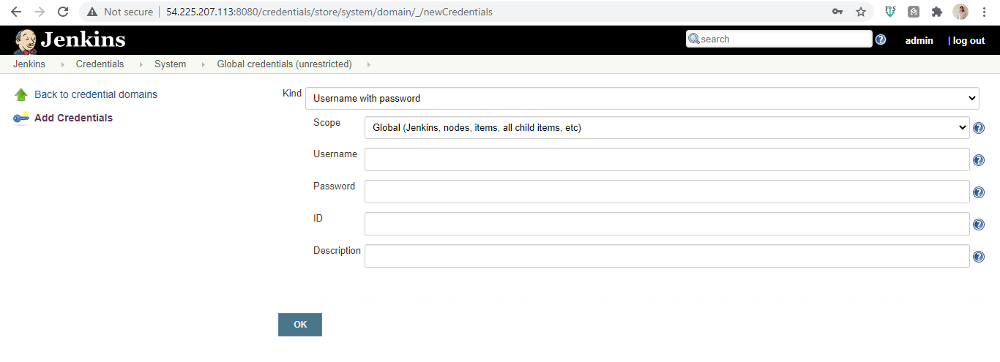
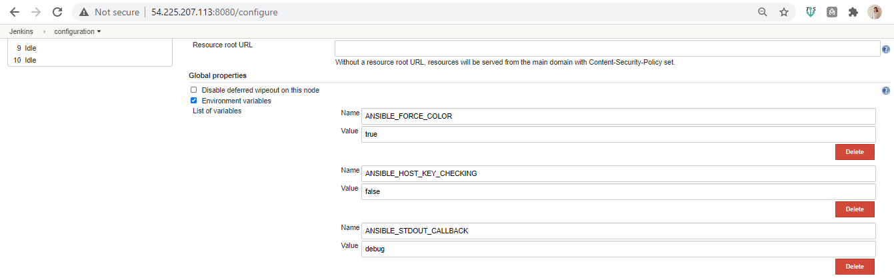
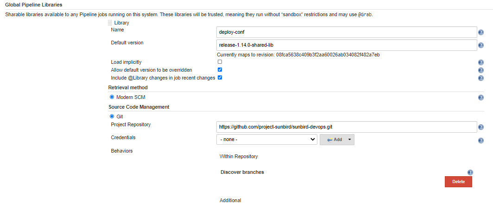
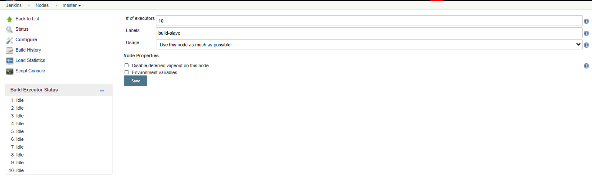
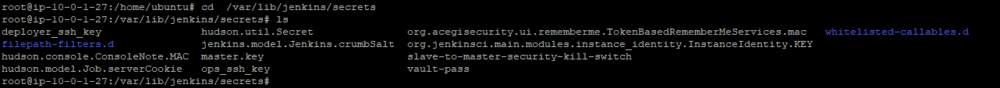
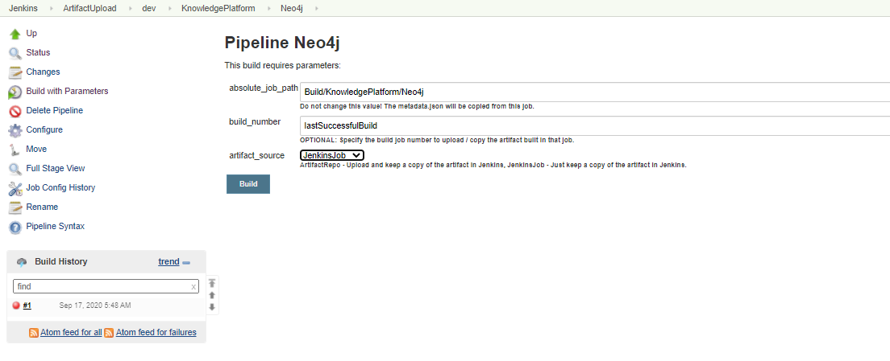

[1.0 ]{.c41 .c30}[Host set up]{.c31 .c30}

[Update /etc/hosts file with all host name ]{.c7 .c30}

[]{.c2}

[vi /etc/hosts]{.c49 .c54 .c87}

[]{.c7}

[10.0.1.]{.c49 .c54}[x]{.c49}[ ip-10.0.1.]{.c49 .c54}[x]{.c49}

[10]{.c49 .c54}[.]{.c49}[0]{.c49 .c54}[.]{.c49}[3-]{.c49
.c54}[x]{.c49}[ ip-10-0-3-]{.c49 .c54}[x]{.c49}

[10]{.c49 .c54}[.]{.c49}[0-3-]{.c49 .c54}[x]{.c49}[ ip-10-0-3-]{.c49
.c54}[x]{.c49}

[10-0-3-]{.c49 .c54}[x]{.c49}[ ip-10-0-3-]{.c49 .c54}[x]{.c49}

[10-0-3-]{.c49 .c54}[x]{.c49}[ ip-10-0-3-]{.c49 .c54}[x]{.c49}

[10-0-1-]{.c49 .c54}[x]{.c49}[ ip-10-0-1-]{.c49 .c54}[x]{.c49}

[10-0-1-]{.c49 .c54}[x]{.c49}[ ip-10-0-1-]{.c49 .c54}[x]{.c49}

[10-0-3-]{.c49 .c54}[x]{.c49}[ ip-10-0-3-]{.c49 .c54}[x]{.c49}

[10-0-3-]{.c49 .c54}[x]{.c49}[ ip-10-0-3-]{.c49 .c54}[x]{.c49}

[10-0-3-]{.c49 .c54}[x]{.c49}[ ip-10-0-3-]{.c49 .c54}[x]{.c49}

[10-0-3-]{.c49 .c54}[x]{.c49}[ ip-10-0-3-]{.c49 .c54}[x]{.c49}

[In “FS-Core-db” server, except Core Db Host name add all names in host
file]{.c7 .c30}

[           ]{.c69}

[1.1 Jenkins Setup – First Run]{.c31 .c30}

-   [SSH to the Jenkins server]{.c8}

[git
clone ]{.c49}[[https://github.com/project-sunbird/sunbird-devops.git](https://www.google.com/url?q=https://github.com/project-sunbird/sunbird-devops.git&sa=D&ust=1604399966385000&usg=AOvVaw329cG6iMqgzZmfZ-wp9grD){.c44}]{.c49}

[]{.c49 .c54 .c87}

[cd sunbird-devops && git checkout tags/release-1.14.0 -b
release-1.14.0]{.c49 .c54 .c87}

[\
cd deploy/Jenkins]{.c49 .c54 .c87}

[]{.c49 .c54 .c87}

[Note: Edit jenkins-server-setup.sh  to update the version of jenkin to
2.204 ]{.c49 .c54 .c30 .c87}

[]{.c49 .c54 .c30 .c87}

[       sudo bash jenkins-server-setup.sh]{.c49 .c54 .c30 .c87}

[]{.c49 .c54 .c30 .c87}

-   [Once the jenkins-server-setup.sh script completes, open jenkins in
    browser by typing domain-name:8080 / public-ip:8080]{.c49 .c54 .c30
    .c87}

[ Enter the initial password. Follow the on screen instructions]{.c8}

[]{.c8}

-   [Choose install suggested plugin]{.c8}

[Create a admin user]{.c8}

[User name: admin]{.c8}

[Password: &lt;initial password&gt;]{.c8}

[Email : &lt;communication email&gt;]{.c8}

[]{.c8}

-   [Choose the default jenkins URL. You can either change this to your
    domain name or public IP. If in doubt, just use whatever is
    displayed on screen as this can be changed later if required in
    Jenkins configuration.]{.c8}

[]{.c8}

[[http://IP:8080/](https://www.google.com/url?q=http://ip:8080/&sa=D&ust=1604399966388000&usg=AOvVaw1RCBH2nblpyC6Ne2N3iZSR){.c44}]{.c74
.c69 .c30 .c91}[ ]{.c7 .c30}

[]{.c7 .c30}

-   [switch back to the terminal session on the Jenkins server]{.c7
    .c30}

[sudo bash jenkins-plugins-setup.sh\
]{.c69}[Enter the URL as localhost:8080\
Enter the admin username and password]{.c69 .c30}

[]{.c8}

[]{.c8}

-   [Now go to Manage Jenkins -&gt; Manage Plugins -&gt; Update Center
    -&gt; Check status of plugin install. If any plugins failed to
    install, install them manually by visiting the plugins section of
    Jenkins]{.c7 .c30}

[]{.c16}

[]{.c16}

-   [Now switch back to the terminal session on the Jenkins server]{.c7
    .c30}

[cp envOrder.txt.sample envOrder.txt]{.c25}[\
]{.c47}[vi envOrder.txt]{.c7}

[]{.c7}

-   [Update the environment list as per your infrastructure in ascending
    order. For example if you have only dev and production, your ]{.c24
    .c30}[envOrder.txt]{.c24}[ will look like]{.c7 .c30}

[  ]{.c47 .c30}[dev=0]{.c7}

[ production=1]{.c7}

[]{.c7}

-   [ Now run the ]{.c24 .c30}[jenkins-jobs-setup.sh]{.c24}[ script]{.c7
    .c30}

[]{.c7}

[sudo bash jenkins-jobs-setup.sh]{.c7}

[]{.c2}

[]{.c2}

-   [Follow the onscreen instruction of the script. Provide choice as
    “yes” for all questions. The options are case sensitive, the script
    will display the accepted options.]{.c7 .c30}

[]{.c7 .c30}

[]{.c7 .c30}

-   [Once the script completes copying the job config, go to the browser
    and restart jenkins using ]{.c24
    .c30}[public-ip:8080/restart]{.c24}[ OR ]{.c24
    .c30}[domain-name:8080/restart]{.c7}

[]{.c7}

[]{.c2}

-   [Go to ]{.c24
    .c30}[http://&lt;jenkins\_domain&gt;/credentials/store/system/domain/\_/newCredentials]{.c24}[\
    Select Username with Password]{.c7 .c30}

[]{.c7 .c30}

[]{.c7 .c30}

-   [Enter the username and password of the github account where the
    private repo will be hosted.]{.c7 .c30}

[]{.c2}

[Enter a unique long string for the ID field such as ]{.c48
.c30}[private-repo-creds]{.c23}

[\
you can provide the description as private repo credentials and click
OK.]{.c8}

[]{.c8}

[]{style="overflow: hidden; display: inline-block; margin: 0.00px 0.00px; border: 0.00px solid #000000; transform: rotate(0.00rad) translateZ(0px); -webkit-transform: rotate(0.00rad) translateZ(0px); width: 624.00px; height: 226.13px;"}

[]{.c2}

-   [Goto ]{.c24 .c30}[http://&lt;jenkins\_domain&gt;/configure]{.c74
    .c25 .c81 .c30 .c87}

[]{.c74 .c25 .c81 .c30 .c87}

-   [Choose the check box named “Environment variables”]{.c7 .c30}

[]{.c7 .c30}

[]{.c7 .c30}

-   [Click on Add and enter the following Name, Value pairs]{.c7 .c30}

[\
]{.c47 .c54}

[]{#t.89a00ab9fbf07523e7cc8778cecdd71cd2d0fbf1}[]{#t.0}
+-----------------------------------+-----------------------------------+
| [Name]{.c7}                       | [Value]{.c7}                      |
+-----------------------------------+-----------------------------------+
| [ANSIBLE\_FORCE\_COLOR]{.c7}      | [true]{.c7}                       |
+-----------------------------------+-----------------------------------+
| [ANSIBLE\_HOST\_KEY\_CHECKING]{.c | [false]{.c7}                      |
| 7}                                |                                   |
+-----------------------------------+-----------------------------------+
| [ANSIBLE\_STDOUT\_CALLBACK]{.c7}  | [debug]{.c7}                      |
+-----------------------------------+-----------------------------------+
| [hub\_org]{.c7}                   | [docker hub organization /        |
|                                   | username eg: In sunbird/player    |
|                                   | image, sunbird is the             |
|                                   | hub\_org]{.c7}                    |
+-----------------------------------+-----------------------------------+
| [private\_repo\_branch]{.c7}      | [The branch name in the private   |
|                                   | repository which you would like   |
|                                   | to use. This branch will have the |
|                                   | inventory and secrets]{.c7}       |
+-----------------------------------+-----------------------------------+
| [private\_repo\_credentials]{.c7} | [The unique string which you      |
|                                   | provided for ID field while       |
|                                   | entering the github repo          |
|                                   | credentials.                      |
|                                   | eg: private-repo-creds]{.c7}      |
+-----------------------------------+-----------------------------------+
| [private\_repo\_url]{.c7}         | [The github URL to your private   |
|                                   | repo. You can visit your private  |
|                                   | repo and click on clone button,   |
|                                   | which will display the https URL  |
|                                   | to your private repository. Only  |
|                                   | https URL is currently            |
|                                   | ]{.c24}[supported]{.c25}[.]{.c7}  |
+-----------------------------------+-----------------------------------+
| [public\_repo\_branch]{.c7}       | [This is the branch or tag from   |
|                                   | where Jenkinsfile will be picked  |
|                                   | up. You can set this value as     |
|                                   | refs/tags/release-1.14.0 if you   |
|                                   | want to build from tags or        |
|                                   | provide the value of development  |
|                                   | branch like release-1.15 (not     |
|                                   | ]{.c24}[recommended]{.c25}[ since |
|                                   | development branches are not      |
|                                   | stable). ]{.c7}                   |
+-----------------------------------+-----------------------------------+

[]{.c16}

[]{.c16}

[]{style="overflow: hidden; display: inline-block; margin: 0.00px 0.00px; border: 0.00px solid #000000; transform: rotate(0.00rad) translateZ(0px); -webkit-transform: rotate(0.00rad) translateZ(0px); width: 624.00px; height: 195.47px;"}

[]{.c7}

-   [Scroll down to “Global Pipeline Libraries” section and click Add.
    Provide the values as below]{.c7 .c30}

[]{.c7 .c30}

[]{#t.b8d6ec63c451169c8e569cda8493891d968650ea}[]{#t.1}
+-----------------------------------+-----------------------------------+
| [Name]{.c69}                      | [Value]{.c23}                     |
+-----------------------------------+-----------------------------------+
| [Library Name]{.c23}              | [deploy-conf]{.c23}               |
+-----------------------------------+-----------------------------------+
| [Default version]{.c23}           | [Tag name of the jenkins shared   |
|                                   | library. This should be same      |
|                                   | version of the release you are    |
|                                   | going to build and deploy. For    |
|                                   | example, if you decide to use     |
|                                   | tags release-1.14.0 as your base, |
|                                   | jenkins shared library tag will   |
|                                   | be release-1.14.0-shared-lib.     |
|                                   | When you upgrade to tags          |
|                                   | release-1.15.0, this value should |
|                                   | get changed to                    |
|                                   | release-1.15.0-shared-lib]{.c23}  |
+-----------------------------------+-----------------------------------+
| [Retrieval method]{.c23}          | [Modern SCM]{.c23}                |
+-----------------------------------+-----------------------------------+
| [Source Code Management]{.c23}    | [Git]{.c23}                       |
+-----------------------------------+-----------------------------------+
| [Project Repository]{.c23}        | [[https://github.com/project-sunb |
|                                   | ird/sunbird-devops.git](https://w |
|                                   | ww.google.com/url?q=https://githu |
|                                   | b.com/project-sunbird/sunbird-dev |
|                                   | ops.git&sa=D&ust=1604399966408000 |
|                                   | &usg=AOvVaw3z3Vj2Dkt5traeJlYzGQfC |
|                                   | ){.c44}]{.c69                     |
|                                   | .c89}                             |
+-----------------------------------+-----------------------------------+

[]{style="overflow: hidden; display: inline-block; margin: 0.00px 0.00px; border: 0.00px solid #000000; transform: rotate(0.00rad) translateZ(0px); -webkit-transform: rotate(0.00rad) translateZ(0px); width: 624.00px; height: 257.47px;"}

[]{.c23}

-   [Click on Save and go to Manage Jenkins -&gt; Configure global
    security]{.c7 .c30}

[]{.c7 .c30}

[]{.c7 .c30}

-   [Choose the “Markup Formatter” as “Safe HTML”]{.c7 .c30}

[]{.c2}

[]{style="overflow: hidden; display: inline-block; margin: 0.00px 0.00px; border: 0.00px solid #000000; transform: rotate(0.00rad) translateZ(0px); -webkit-transform: rotate(0.00rad) translateZ(0px); width: 624.00px; height: 93.73px;"}

[]{.c23}

-   [Go to Manage Jenkins -&gt; Manage Nodes -&gt; Click master -&gt;
    Click Configure -&gt; Provide labels as “]{.c24
    .c30}[build-slave]{.c24}[”]{.c7 .c30}

[]{.c7 .c30}

-   [Set the number of executors to a number like 15 if your system
    configuration is 16 GB RAM and 4 core CPU. Adjust this number
    accordingly based on your system configuration]{.c7 .c30}

[]{.c7 .c30}

[]{style="overflow: hidden; display: inline-block; margin: 0.00px 0.00px; border: 0.00px solid #000000; transform: rotate(0.00rad) translateZ(0px); -webkit-transform: rotate(0.00rad) translateZ(0px); width: 624.00px; height: 189.67px;"}

-   [Switch back to the terminal session on Jenkins server]{.c7 .c30}

[]{.c7 .c30}

[]{.c7 .c30}

-   [Restart jenkins by running sudo service jenkins restart]{.c7 .c30}

[]{.c7 .c30}

[]{.c7 .c30}

-   [Execute below command to create SSH config file]{.c7 .c30}

[]{.c7 .c30}

[sudo su jenkins]{.c23}

[]{.c23}

[\
mkdir -p /var/lib/jenkins/secrets && cd /var/lib/jenkins/secrets]{.c23}

[]{.c23}

[]{.c23}

[touch deployer\_ssh\_key ops\_ssh\_key vault-pass]{.c23}

[]{.c23}

[\
chmod 400 deployer\_ssh\_key ops\_ssh\_key vault-pass]{.c23}

[]{.c2}

[]{style="overflow: hidden; display: inline-block; margin: 0.00px 0.00px; border: 0.00px solid #000000; transform: rotate(0.00rad) translateZ(0px); -webkit-transform: rotate(0.00rad) translateZ(0px); width: 648.00px; height: 55.47px;"}

-   [The key which you used to login to the Jenkins server will be
    called as ops\_ssh\_key from now ]{.c24 .c30}[onwards]{.c25 .c30}[.
    Example]{.c7 .c30}

[]{.c7}

[]{.c7}

[ssh -i somekey.pem ubuntu@jenkins-server-ip]{.c23}

[]{.c23}

[\
]{.c48}[Here somekey.pem is the key you used to login to the Jenkins
server which will be called as ops\_ssh\_key]{.c23}

[]{.c23}

[]{.c23}

-   [Copy the contents of the key you used to connect to VM
    into ops\_ssh\_key file]{.c7 .c30}

[]{.c7 .c30}

[]{.c7 .c30}

-   [Create a new ssh key on your local machine or any server. We will
    use this for a user named deployer (or any name you like)]{.c7 .c30}

[]{.c7 .c30}

[]{.c7 .c30}

[ ssh-keygen -f deployer\_ssh\_key (passphrase should be empty)]{.c7
.c30}

[]{.c2}

[]{.c2}

-   [Copy the contents  of the  deployer\_ssh\_key into
    /var/lib/jenkins/secrets/deployer\_ssh\_key]{.c7 .c30}

[]{.c2}

[]{.c2}

-   [If your github private repo consists of ansible encrypted files,
    then enter the decryption password]{.c7 .c30}

[]{.c7 .c30}

[in /var/lib/jenkins/secrets/vault-pass. If there are no encrypted
files, then enter some random value like 12345 into the vault-pass file.
This file cannot be empty.]{.c23}

[]{.c23}

-   [Restart Jenkins server]{.c7 .c30}

[]{.c7 .c30}

[]{.c7 .c30}

-   [ Follow the next set of steps to create inventory, secrets and
    ansible hosts in the private repo.]{.c7 .c30}

[]{.c7 .c30}

[]{.c7 .c30}

[Updating private repo with hosts and variables]{.c99 .c54 .c87}

[]{.c54 .c87 .c99}

[]{.c7 .c30}

1.  [git clone ]{.c69}[[https://github.com/project-sunbird/sunbird-devops](https://www.google.com/url?q=https://project-sunbird/sunbird-devops&sa=D&ust=1604399966416000&usg=AOvVaw27kq4VlNtTcjijGY17pQ0T){.c44}]{.c69}

[]{.c23}

2.  [cd sunbird-devops && git checkout tags/release-1.14.0 -b
    release-1.14.0]{.c23}

[]{.c23}

3.  [cp -rf sunbird-devops/private\_repo .]{.c23}

[]{.c23}

4.  [cd private\_repo]{.c23}

[]{.c23}

5.  [Folder Structure for the private directory which contains ansible
    hosts secrets and variables.]{.c23}

[Folder Structure]{.c99 .c54 .c87}

[]{#t.0c29e1d79d7b983797c3c270daf09d56b6478e58}[]{#t.2}
+-----------------------------------------------------------------------+
| [\~/Documents/projects/subird-devops/private\_repo]{.c16}             |
|                                                                       |
| [ansible]{.c16}                                                       |
|                                                                       |
| [└── inventory]{.c16}                                                 |
|                                                                       |
| [    └── dev]{.c16}                                                   |
|                                                                       |
| [        ├── Core]{.c16}                                              |
|                                                                       |
| [        │   ├── common.yml]{.c16}                                    |
|                                                                       |
| [        │   ├── hosts]{.c16}                                         |
|                                                                       |
| [        │   └── secrets.yml]{.c16}                                   |
|                                                                       |
| [        ├── DataPipeline]{.c16}                                      |
|                                                                       |
| [        │   ├── common.yml]{.c16}                                    |
|                                                                       |
| [        │   ├── hosts]{.c16}                                         |
|                                                                       |
| [        │   └── secrets.yml]{.c16}                                   |
|                                                                       |
| [        └── KnowledgePlatform]{.c16}                                 |
|                                                                       |
| [            ├── common.yml]{.c16}                                    |
|                                                                       |
| [            ├── hosts]{.c16}                                         |
|                                                                       |
| [            └── secrets.yml]{.c16}                                   |
|                                                                       |
| [ ]{.c16}                                                             |
|                                                                       |
| [5 directories, 9 files]{.c16}                                        |
+-----------------------------------------------------------------------+

[]{.c7}

6.  [git init]{.c23}

[]{.c23}

7.  [git add .]{.c23}

[]{.c23}

8.  [git commit -m"Creating private files"]{.c23}

[]{.c23}

9.  [git remote add origin &lt;private repo url&gt;]{.c23}

[]{.c23}

10. [git branch --set-upstream-to=origin/master master && git push
    --set-upstream origin master]{.c23}

[]{.c23}

11. [update the variables and push it to upstream.]{.c23}

[]{.c23}

[Updating variables and hosts]{.c99 .c54 .c87}

[]{.c99 .c54 .c87}

12. [cd private\_repo/ansible/inventory/dev/&lt;module&gt;/]{.c23}

[]{.c23}

13. [update hosts common.yml secrets.yml]{.c23}

[\
]{.c47}

[]{#t.383a30a352a9a46cc4500e6bb01adccadbe5fe6a}[]{#t.3}
[[S.NO](https://www.google.com/url?q=http://s.no/&sa=D&ust=1604399966423000&usg=AOvVaw2VtJQVLSG0Dvst8HneRUCH){.c44}]{.c69}

[Service]{.c16}

[Server]{.c16}

[IP Address of the machine]{.c16}

[Ansible Group Name]{.c16}

[Module]{.c16}

[1]{.c16}

[jenkins-master]{.c16}

[]{.c16}

[]{.c16}

[]{.c16}

[Core]{.c16}

[2]{.c16}

[manager]{.c16}

[Server-1 (swarm)]{.c16}

[]{.c16}

[swarm-manager-1,swarm-agent-for-prometheus-1\
swarm-agent-for-grafana-1, swarm-agent-for-alertmanager-1,]{.c16}

[3]{.c16}

[log-es]{.c16}

[log-es-1]{.c16}

[4]{.c16}

[]{.c16}

[]{.c16}

[5]{.c16}

[keycloak]{.c16}

[Server-2 (core-db)]{.c16}

[]{.c16}

[keycloak-1]{.c16}

[6]{.c16}

[cassandra-lms (core)]{.c16}

[cassandra-1]{.c16}

[8]{.c16}

[Postgress]{.c16}

[postgresql-master-1, postgresql-slave-1]{.c16}

[9]{.c16}

[es-lms-1]{.c16}

[es-1]{.c16}

[10]{.c16}

[cassandra-lp-dp]{.c16}

[Server-3 (lp-db)]{.c16}

[]{.c16}

[lp-cassandra, dp-cassandra]{.c16}

[KnowledgePlatform]{.c16}

[11]{.c16}

[kp-dp-es-1]{.c16}

[composite-search-cluster,es-ps]{.c16}

[12]{.c16}

[Postgress]{.c16}

[]{.c16}

[13]{.c16}

[neo4j]{.c16}

[learning-neo4j-node1]{.c16}

[14]{.c16}

[learning-1]{.c16}

[Server-4 (lp-services)]{.c16}

[]{.c16}

[learning1,logstash-ps]{.c16}

[15]{.c16}

[redis]{.c16}

[redis1]{.c16}

[16]{.c16}

[search]{.c16}

[search1]{.c16}

[17]{.c16}

[spark]{.c16}

[Server 5 (spark)]{.c16}

[]{.c16}

[spark]{.c16}

[Data Pipeline]{.c16}

[18]{.c16}

[yarn-rm]{.c16}

[Server 6 (yarn-RM)]{.c16}

[]{.c16}

[yarn-master,yarn-ps]{.c16}

[19]{.c16}

[yarn-slave]{.c16}

[Server 7 (yarn-slave)]{.c16}

[]{.c16}

[yarn-slave,yarn-ps]{.c16}

[20]{.c16}

[analytics-api]{.c16}

[Server 8 (dp-services)]{.c16}

[]{.c16}

[analytics-api, analytics-ps,]{.c16}

[21]{.c16}

[kafka-indexer]{.c16}

[kafka-indexer]{.c16}

[22]{.c16}

[secor]{.c16}

[secor, secor-ps]{.c16}

[23]{.c16}

[InfluxDB]{.c16}

[]{.c16}

[24]{.c16}

[kafka (Kp, Dp. Core)]{.c16}

[Server 9 (kafka)]{.c16}

[]{.c16}

[processing-cluster-kafka, processing-cluster-zookeepers, kafka-ps\
kafka-1]{.c16}

[Common]{.c16}

[]{.c23}

[2. ]{.c41 .c30}[Knowledge Platform]{.c31 .c30}

[2.1 Build]{.c31 .c30}

-   [Login to Jenkins UI]{.c7 .c30}

[]{.c7 .c30}

-   [Switch ]{.c24 .c30}[to the Build]{.c25 .c30}[ folder and run all
    jobs ]{.c24 .c30}[in the KnowledgePlatform]{.c25 .c30}[ folder.]{.c7
    .c30}

[]{.c7 .c30}

[]{.c7 .c30}

[Update the repo and branch of Neo4j job as below]{.c7 .c30}

[]{.c7 .c30}

[[https://github.com/project-sunbird/sunbird-learning-platform.git](https://www.google.com/url?q=https://github.com/project-sunbird/sunbird-learning-platform.git&sa=D&ust=1604399966480000&usg=AOvVaw0xXIhAz9KADZXOgqjOqpaf){.c44}]{.c17}

[]{.c23}

[refs/tags/release-2.2.1\_RC8]{.c23}

[]{.c23}

[]{.c23}

-   [Switch the artifactUpload /dev/ folder and Run all the job manually
    with option "jenkin job" in Knowledge Platform folder.]{.c7 .c30}

[]{.c7 .c30}

[]{.c2}

[]{style="overflow: hidden; display: inline-block; margin: 0.00px 0.00px; border: 0.00px solid #000000; transform: rotate(0.00rad) translateZ(0px); -webkit-transform: rotate(0.00rad) translateZ(0px); width: 624.00px; height: 253.80px;"}

-   [After running build job run Switch to
    Jenkins/OpsAdministration/dev/KnowledgePlatform folder and run
    Bootstrap job ]{.c7 .c30}

[]{.c7 .c30}

[]{.c7 .c30}

-   [Switch to Jenkins/OpsAdministration/dev/DataPipeline folder and run
    Bootstrap job]{.c7 .c30}

[]{.c2}

[2.2 Provision]{.c31 .c30}

[Switch to Provision/dev/KnowledgePlatform and run jobs in following
order]{.c7 .c30}

-   [Cassandra]{.c16}
-   [CompositeSearch]{.c16}
-   [Neo4j]{.c16}
-   [Zookeeper]{.c16}
-   [Kafka]{.c16}
-   [Learning]{.c16}
-   [Redis]{.c16}
-   [Search]{.c16}

[Update the repo and branch of Neo4j job as below]{.c7 .c30}

[]{.c23}

[[https://github.com/eagle-sb/sunbird-learning-platform.git](https://www.google.com/url?q=https://github.com/eagle-sb/sunbird-learning-platform.git&sa=D&ust=1604399966483000&usg=AOvVaw3d52SWYEYKiS2WCC9ueC8d){.c44}]{.c48}

[release-1.14.0]{.c23}

[]{.c23}

[Update the repo and branch of Zookeeper job as below]{.c7 .c30}

[]{.c7 .c30}

[https://github.com/eagle-sb/sunbird-learning-platform.git]{.c23}

[release-1.14.0]{.c23}

[]{.c23}

[]{.c23}

[Update the repo and branch of Zookeeper job as below]{.c7 .c30}

[]{.c7 .c30}

[https://github.com/eagle-sb/sunbird-learning-platform.git]{.c23}

[release-1.14.0]{.c23}

[Update the repo and branch of Zookeeper job as below]{.c7 .c30}

[]{.c7 .c30}

[https://github.com/eagle-sb/sunbird-learning-platform.git]{.c23}

[release-1.14.0]{.c23}

[]{.c23}

[]{.c23}

[2.3 ]{.c41 .c30}[Deploy]{.c30 .c31}

[Switch to Deploy/dev/KnowledgePlatform and run all jobs in the
following order]{.c7 .c30}

-   [CassandraDbUpdate]{.c47}
-   [Neo4j]{.c47}
-   [StartNeo4jCluster]{.c47}
-   [Learning]{.c47}
-   [Search]{.c47}
-   [Neo4jDefinitionUpdate]{.c47}
-   [KafkaSetup]{.c47}

[Neo4jDefinitionUpdate Update the repo and branch ]{.c7 .c30}

[]{.c7 .c30}

[https://github.com/project-sunbird/sunbird-learning-platform.git]{.c23}

[refs/tags/release-2.2.1\_RC8]{.c23}

[]{.c23}

[        ]{.c69}

-   [Manual Run - Content retire API]{.c7 .c30}

[]{.c2}

[Login to the cassandra VM and run the below commands]{.c16}

[]{.c16}

[]{.c2}

[vi /etc/cassandra/cassandra.yaml]{.c23}

[]{.c23}

[]{.c23}

[Update the value as batch\_size\_fail\_threshold\_in\_kb: 200]{.c23}

[]{.c23}

[]{.c23}

[service cassandra restart]{.c23}

[]{.c23}

[]{.c23}

[cd /tmp]{.c23}

[]{.c23}

[]{.c23}

[wget
]{.c48}[[https://sunbirdpublic.blob.core.windows.net/installation/script\_data.csv](https://www.google.com/url?q=https://sunbirdpublic.blob.core.windows.net/installation/script_data.csv&sa=D&ust=1604399966487000&usg=AOvVaw1nVVvjr8GqHGbBHuGhgc8H){.c44}]{.c17}

[]{.c23}

[Run cqlsh]{.c23}

[]{.c23}

[]{.c23}

[COPY dev\_script\_store.script\_data FROM '/tmp/script\_data.csv';  
 (Here dev will be you env name)]{.c23}

[]{.c23}

[]{.c23}

[SELECT COUNT(\*) FROM dev\_script\_store.script\_data ;       (Output
should be 324 rows)]{.c23}

[]{.c23}

[]{.c23}

[Login to learning VM and restart tomcat]{.c23}

[]{.c23}

[]{.c23}

[sudo service tomcat restart]{.c23}

[]{.c23}

[]{.c23}

[Now you should be able to delete contents from workspace, drafts,
contents which are published etc.]{.c23}

[]{.c23}

[]{.c16 .c30}

-   [Switch to ]{.c24 .c30}[Deploy/dev/]{.c24}[DataPipeline folder and
    ]{.c24 .c30}[provision/dev/]{.c24}[DataPipeline  run all jobs. ]{.c7
    .c30}

[Run yarn job job]{.c8}

[]{.c8}

[Note:Yarn provision and deploy needs to be done from DP]{.c8}

[]{.c8}

[]{.c8}

[3. Data Pipeline]{.c31 .c30}

[3.1 Build]{.c31 .c30}

[Switch ]{.c24 .c30}[to the Build]{.c25 .c30}[ folder ]{.c24 .c30}[of
the data]{.c25 .c30}[ pipeline module and run all jobs. ]{.c7 .c30}

[]{.c7 .c30}

[3.2 ]{.c41 .c30}[Provision]{.c31 .c30}

[Switch to Provision/&lt;env&gt;/DataPipeline and run all jobs]{.c7
.c30}

[]{.c7 .c30}

-   [AnalyticsApi]{.c23}
-   [AnalyticsSecor]{.c23}
-   [AnalyticsSpark]{.c23}
-   [Influxdb]{.c23}
-   [Kibana]{.c23}
-   [Postgress]{.c23}
-   [Yarn]{.c23}

[]{.c23}

[Analytics Spark Update the repo and branch]{.c7 .c30}

[]{.c23}

[https://github.com/eagle-sb/sunbird-data-pipeline.git]{.c23}

[release-1.14.0\_eagle]{.c23}

[ Execute below command before running job]{.c16}

-   [gem update --system ]{.c69 .c30}
-   [/usr/local/bin/gem install --no-user-install --no-document
    bundler]{.c69 .c30}

[Run all jobs in Jenkins/ArtifactUpload/dev/DataPipeline]{.c7 .c30}

[3.3 ]{.c30 .c41}[Deploy]{.c31 .c30}

[Switch to Deploy/dev/DataPipeline and run all jobs in following
order]{.c7 .c30}

-   [CassandraDbUpdate]{.c69}
-   [KafkaSetup]{.c69}
-   [AnalyticsApi]{.c69}
-   [DataProducts]{.c69}
-   [Secor]{.c69}
-   [KafkaIndexer]{.c69}
-   [SamzaTelemertySchemas]{.c69}
-   [Yarn]{.c69}

[AnalyticsApi Update the repo and branch]{.c7 .c30}

[]{.c2}

[https://github.com/eagle-sb/sunbird-data-pipeline.git]{.c23}

[release-1.14.0\_eagle]{.c23}

[]{.c16}

[ KafkaIndexer Update the repo and branch]{.c7 .c30}

[]{.c2}

[https://github.com/eagle-sb/sunbird-data-pipeline.git]{.c23}

[release-1.14.0\_eagle]{.c23}

[]{.c16}

[4 ]{.c41 .c30}[Core]{.c31 .c30}

[Switch to Jenkins/OpsAdministration/dev/core folder and run Bootstrap
job]{.c7 .c30}

[]{.c7 .c30}

[4.1 ]{.c41}[Builds]{.c41}[:]{.c31 .c30}

-   [Switch ]{.c24 .c30}[to the Build]{.c25 .c30}[ folder and run all
    jobs ]{.c24 .c30}[in the core]{.c25 .c30}[ folder.]{.c7 .c30}

<!-- -->

-   [AdminUtils]{.c23}
-   [APIManager]{.c23}
-   [APIManagerEcho]{.c23}
-   [Cassandra]{.c23}
-   [Keycloak]{.c23}
-   [Proxy]{.c23}

[Provision:]{.c31}

-   [Switch ]{.c24 .c30}[to the Provision]{.c25 .c30}[ folder and run
    all jobs ]{.c24 .c30}[in the core]{.c25 .c30}[ folder.]{.c24 .c30}

<!-- -->

-   [Cassandra]{.c23}
-   [Keycloak]{.c23}
-   [Postgres]{.c23}
-   [PostgresDbUpdate]{.c23}
-   [Cassandra]{.c23}

<!-- -->

-   [Cassandra Update the repo and branch  ]{.c7 .c30}

[]{.c2}

[[https://github.com/eagle-sb/sunbird-devops.git](https://www.google.com/url?q=https://github.com/eagle-sb/sunbird-devops.git&sa=D&ust=1604399966501000&usg=AOvVaw2j9cPLGSVD9AiTTEZ5dqEW){.c44}]{.c17}

[release-1.14.0\_eagle]{.c23}

[]{.c23}

[4.2 ]{.c41}[Deploy]{.c31}

-   [Switch ]{.c24 .c30}[to the deploy]{.c25 .c30}[ folder and run all
    jobs ]{.c24 .c30}[in the core]{.c25 .c30}[ folder.]{.c7 .c30}

<!-- -->

-   [ApplicationElasticSearch]{.c23}
-   [Cassandra]{.c23}
-   [Keycloak]{.c23}
-   [Proxy]{.c23}

<!-- -->

-   [ApplicationElasticSearch Update the repo and branch  ]{.c7 .c30}

[]{.c2}

[https://github.com/eagle-sb/sunbird-devops.git]{.c23}

[release-1.14.0\_eagle]{.c23}

[]{.c23}

-   [Proxy Update the repo and branch  ]{.c7 .c30}

[]{.c2}

[https://github.com/aastar-dev1/sunbird-devops.git]{.c23}

[release-1.1]{.c23}

[]{.c23}

-   [install elastic search with latest version in core db server]{.c7
    .c30}

[]{.c54 .c69 .c87 .c110}

[5 ]{.c41}[Eagle setup]{.c31}

-   [Login to core DB server]{.c7 .c30}

[]{.c7 .c30}

-   [Clone the repo git clone ]{.c24
    .c30}[[https://github.com/igot-gov/Eagle](https://www.google.com/url?q=https://github.com/igot-gov/Eagle&sa=D&ust=1604399966504000&usg=AOvVaw2sfxw7XPgYNmljPkPe8YGi){.c44}]{.c74
    .c25 .c30 .c81}

[]{.c7 .c30}

-   [cd db\_scripts ]{.c7 .c30}

[]{.c2}

[5.1 ]{.c41}[Set up of Cassandra DB]{.c31}

-   [Go to the scripts directory for Cassandra]{.c7 .c30}

[]{.c2}

[cd /home/ubuntu/Eagle/db\_scripts/Cassandra]{.c23}

[]{.c2}

-   [Run first create-keyspace.cql as below]{.c7 .c30}

[]{.c2}

[cqlsh -f create-keyspace.cql]{.c23}

[]{.c16}

-   [ ]{.c54 .c69 .c83 .c30}[run remaining script in the following
    order]{.c7 .c30}

[                ]{.c69}[++++++++++++++++++++++++++++++++++++]{.c23}

[   cqlsh -f create-keyspace.cql]{.c23}

[    cqlsh -f authoring.cql]{.c23}

[    cqlsh -f content\_source.cql]{.c23}

[    cqlsh -f goals.cql]{.c23}

[   cqlsh -f Notification.cql]{.c23}

[   cqlsh -f rating.cql]{.c23}

[    cqlsh -f timespent.cql]{.c23}

[    cqlsh -f badge.cql]{.c23}

[   cqlsh -f continuelearning.cql]{.c23}

[   cqlsh -f playlist.cql]{.c23}

[   cqlsh -f roles.cql]{.c23}

[   cqlsh -f tnc.cql]{.c23}

[   cqlsh -f cohorts.cql]{.c23}

[   cqlsh -f leaderboard.cql]{.c23}

[  cqlsh -f preferences.cql]{.c23}

[   cqlsh -f social.cql]{.c23}

[   cqlsh -f user\_access\_paths.cql]{.c23}

[   cqlsh -f common.cql]{.c23}

[ cqlsh -f events.cql]{.c23}

[    cqlsh -f likes.cql]{.c23}

[      cqlsh -f progress.cql]{.c23}

[   cqlsh -f submissions.cql]{.c23}

[   cqlsh -f user\_access\_paths.cql]{.c23}

[   cqlsh -f Notification.cql]{.c23}

[   cqlsh -f  scrom.cql (; missing in query edit and run the
file)]{.c23}

[    cqlsh -f interest.cql]{.c23}

[+++++++++++++++++++++++++++++++++]{.c23}

[Couldn’t able run these below file]{.c23}

[master\_values.cql]{.c23}

[api\_authentication.cql]{.c23}

[user\_admin\_level.cql]{.c23}

[app\_config\_insert.cql]{.c23}

[user\_shared\_content.cql]{.c23}

[]{.c16}

[5.2 ]{.c41}[Set up of PostgreSQL DB]{.c31}

-   [Created postgres database using below commands]{.c7 .c30}

[]{.c7}

-   [Switched to postgres user]{.c7 .c30}

[]{.c7 .c30}

[sudo su postgres]{.c8}

[         psql]{.c8}

[Create database wingspan;]{.c8}

[create user wingspan with password '&lt;initial password&gt;';]{.c8}

[alter database wingspan owner to wingspan;]{.c8}

[\\l for list databases]{.c8}

[\\q quit from psql]{.c8}

[]{.c8}

-   [Go to the script location
    /home/ubuntu/test/wingspan-database-scripts-db\_scripts/postgres and
    run all the .sql scripts from postgres user]{.c7 .c30}

[]{.c2}

[          ]{.c69 .c30}[first need to run create-schema.sql]{.c8}

[]{.c2}

[PGPASSWORD= &lt;initial password&gt; psql -h localhost -U wingspan -p
5432 -d wingspan -a -f create-schema.sql]{.c8}

[]{.c8}

[PGPASSWORD=&lt;initial password&gt; psql -h localhost -U wingspan -p
5432 -d wingspan -a -f user\_details.sql]{.c8}

[]{.c8}

[PGPASSWORD=&lt;initial password&gt; psql -h localhost -U wingspan -p
5432 -d wingspan -a -f badge.sql]{.c8}

[]{.c8}

[PGPASSWORD=&lt;initial password&gt; psql -h localhost -U wingspan -p
5432 -d wingspan -a -f goals.sql]{.c8}

[]{.c8}

[PGPASSWORD=&lt;initial password&gt; psql -h localhost -U wingspan -p
5432 -d wingspan -a -f userprofiles\_pathfinders.sql]{.c8}

[]{.c8}

[PGPASSWORD=]{.c69 .c30}[ ]{.c69}[&lt;initial password&gt; psql -h
localhost -U wingspan -p 5432 -d wingspan -a -f
batch\_execution.sql]{.c8}

[]{.c8}

[PGPASSWORD=&lt;initial password&gt; psql -h localhost -U wingspan -p
5432 -d wingspan -a -f termsandconditions.sql]{.c8}

[]{.c8}

[PGPASSWORD=&lt;initial password&gt; psql -h localhost -U wingspan -p
5432 -d wingspan -a -f content\_progress.sql]{.c8}

[]{.c2}

[PGPASSWORD=&lt;initial password&gt; psql -h localhost -U wingspan -p
5432 -d wingspan -a -f educator\_mapping.sql]{.c8}

[]{.c8}

[PGPASSWORD=&lt;initial password&gt; psql -h localhost -U wingspan -p
5432 -d wingspan -a -f content\_source.sql]{.c8}

[]{.c8}

[PGPASSWORD=&lt;initial password&gt; psql -h localhost -U wingspan -p
5432 -d wingspan -a -f filters.sql]{.c8}

[]{.c8}

[PGPASSWORD=&lt;initial password&gt; psql -h localhost -U wingspan -p
5432 -d wingspan -a -f notification.sql]{.c8}

[]{.c8}

[PGPASSWORD=&lt;initial password&gt; psql -h localhost -U wingspan -p
5432 -d wingspan -a -f pathfinders\_notfication.sql]{.c8}

[]{.c8}

[PGPASSWORD=&lt;initial password&gt; psql -h localhost -U wingspan -p
5432 -d wingspan -a -f notification\_infosys.sql]{.c8}

[]{.c8}

[cd Notification\\ Final\\ Scripts]{.c8}

[]{.c8}

[PGPASSWORD=&lt;initial password&gt; psql -h localhost -U wingspan -p
5432 -d wingspan -a -f Notification\\ Final\\ Scripts]{.c8}

[]{.c8}

[5.3 ]{.c41}[Set up of Elastic DB]{.c31}

-   [Go to search\_autocomplete  folder]{.c7 .c30}

[open acindexer.py and update as below]{.c8}

[]{.c2}

[esUrl = '10.0.3.]{.c48 .c30}[x]{.c69 .c30}['
\#os.environ\['esurl'\]]{.c8}

[esPort = '9200' \#os.environ\['esport'\]]{.c8}

[esPass = '' \#os.environ\['espass'\]]{.c8}

[esUser = 'elastic' \#os.environ\['esuser'\]]{.c8}

[rootOrg = ']{.c48 .c30}[igot]{.c69 .c30}['
\#os.environ\['rootOrg'\]]{.c8}

[org = ']{.c48 .c30}[dopt]{.c69 .c30}[' \#os.environ\['org'\]]{.c8}

[]{.c2}

-   [then]{.c25 .c30}[ open acindexcreator.py and update as below]{.c7
    .c30}

[esUrl = '10.0.3.]{.c48 .c30}[x’]{.c69
.c30}[ \#os.environ\['esurl'\]]{.c8}

[esPort = '9200'  \#os.environ\['esport'\]]{.c8}

[esPass = '' \#os.environ\['espass'\]]{.c8}

[esUser = 'elastic' \#os.environ\['esuser'\]]{.c8}

[aliases = 'no' \#os.environ\['aliases'\]]{.c8}

[indices = 'yes' \#os.environ\['indices'\]]{.c8}

[]{.c31}

-   [Go to
    DBScripts/elasticsearch/index/search/search\_mappings\_settings.py]{.c7
    .c30}

[==&gt; Change Org and rootOrg==&gt;]{.c7}

-   [mv mlsearchtemplatev6.txt mlsearchtemplatev6.json &lt;Not
    found&gt;]{.c7 .c30}

[]{.c7 .c30}

-   [vi create\_templates.sh]{.c7 .c30}

[echo "Creating ES indices"]{.c8}

[SNAPSHOT=\$(date +%Y\_%m\_%d)]{.c8}

[echo "\$SNAPSHOT"]{.c8}

[es\_ip=&lt;ip of ES server&gt;]{.c8}

[es\_port=9200]{.c8}

[es\_username=elastic]{.c8}

[es\_password=]{.c8}

[folder\_name=templates]{.c8}

[for file in \$folder\_name/\*; do]{.c8}

[        \#echo "\$(basename "\$file")"]{.c8}

[        \#echo "\$file"]{.c8}

[        script\_name=\$(echo \$(basename "\$file") | sed -e
"s/.json//g")]{.c8}

[        \#echo "The index name to be created is \$index\_name"]{.c8}

[        echo "curl -u '\$es\_username:\$es\_password' -H 'Content-Type:
application/json' -XPOST -d @\$(basename "\$file")
http://\$es\_ip:\$es\_port/\_scripts/\$script\_name"]{.c8}

[done]{.c8}

[]{.c8}

-   [run create\_templates.sh script]{.c7 .c30}

[bash create\_templates.sh]{.c8}

[]{.c23}

[curl -u 'elastic:' -H 'Content-Type: application/json' -XPOST -d
@counttemplate.json http://&lt;elastic server
ip&gt;:9200/\_scripts/counttemplate]{.c8}

[]{.c8}

[   curl -u 'elastic:' -H 'Content-Type: application/json' -XPOST -d
@forumtemplate.json http://&lt;elastic server
ip&gt;:9200/\_scripts/forumtemplate]{.c8}

[]{.c8}

[   curl -u 'elastic:' -H 'Content-Type: application/json' -XPOST -d
@hashtagstemplate.json http://&lt;elastic server
ip&gt;:9200/\_scripts/hashtagstemplate]{.c8}

[]{.c8}

[   curl -u 'elastic:' -H 'Content-Type: application/json' -XPOST -d
@mlsearchtemplate.json http://&lt;elastic server
ip&gt;:9200/\_scripts/mlsearchtemplate]{.c8}

[   curl -u 'elastic:' -H 'Content-Type: application/json' -XPOST -d
@mlsearchtemplatev6.json http://&lt;elastic server
ip&gt;:9200/\_scripts/mlsearchtemplatev6]{.c8}

[]{.c8}

[   curl -u 'elastic:' -H 'Content-Type: application/json' -XPOST -d
@posttemplate.json http://&lt;elastic server
ip&gt;:9200/\_scripts/posttemplate]{.c8}

[]{.c8}

[   curl -u 'elastic:' -H 'Content-Type: application/json' -XPOST -d
@searchactemplate.json http://&lt;elastic server
ip&gt;:9200/\_scripts/searchactemplate]{.c8}

[]{.c8}

[   curl -u 'elastic:' -H 'Content-Type: application/json' -XPOST -d
@socialsearchtemplate\_v1.json http://&lt;elastic server
ip&gt;:9200/\_scripts/socialsearchtemplate\_v1]{.c8}

[]{.c8}

[   curl -u 'elastic:' -H 'Content-Type: application/json' -XPOST -d
@tagstemplate.json http://10.0.3.x&lt;elastic server
ip&gt;:9200/\_scripts/tagstemplate]{.c8}

[]{.c8}

[   curl -u 'elastic:' -H 'Content-Type: application/json' -XPOST -d
@threadtemplate.json http://&lt;elastic server
ip&gt;:9200/\_scripts/threadtemplate]{.c8}

[]{.c8}

[   curl -u 'elastic:' -H 'Content-Type: application/json' -XPOST -d
@threadtemplate\_v1.json http://&lt;elastic server
ip&gt;:9200/\_scripts/threadtemplate\_v1]{.c8}

[]{.c8}

[   curl -u 'elastic:' -H 'Content-Type: application/json' -XPOST -d
@threadtemplate\_v2.json http://&lt;elastic server
ip&gt;:9200/\_scripts/threadtemplate\_v2]{.c8}

[]{.c8}

[   curl -u 'elastic:' -H 'Content-Type: application/json' -XPOST -d
@topicsactemplate.json http://&lt;elastic server
ip&gt;:9200/\_scripts/topicsactemplate]{.c8}

[   curl -u 'elastic:' -H 'Content-Type: application/json' -XPOST -d
@userpostactivitytemplate.json http://&lt;elastic server
ip&gt;:9200/\_scripts/userpostactivitytemplate]{.c8}

[]{.c8}

[   curl -u 'elastic:' -H 'Content-Type: application/json' -XPOST -d
@usersearchtemplate\_ford.json ]{.c69 .c30}[http://&lt;elastic server
ip&gt;:9200/\_scripts/usersearchtemplate\_for]{.c8}

[]{.c2}

-   [This will generate script for template creation, like below Run all
    the script from template folder]{.c7 .c30}

[]{.c7 .c30}

-   [update elasticsearch.yml with below configuration and restart
    ES]{.c24 .c30}

[]{.c7 .c30}

[script.max\_size\_in\_bytes: 10000000]{.c8}

-   [Next run script for indices creation ]{.c24 .c30}

[]{.c7 .c30}

[vi create\_indices.sh]{.c8}

[]{.c8}

[echo "Creating ES indices"]{.c8}

[SNAPSHOT=\$(date +%Y\_%m\_%d)]{.c8}

[echo "\$SNAPSHOT"]{.c8}

[es\_ip=10.0.3.249]{.c8}

[es\_port=9200]{.c8}

[es\_username=elastic]{.c8}

[es\_password=]{.c8}

[for file in index/\*; do]{.c8}

[        \#echo "\$(basename "\$file")"]{.c8}

[        \#echo "\$file"]{.c8}

[        index\_name=\$(echo \$file | sed -e
"s/.json/\_\${SNAPSHOT}/g")]{.c8}

[        \#echo "The index name to be created is \$index\_name"]{.c8}

[        echo "curl -u '\$es\_username:\$es\_password' -H 'Content-Type:
application/json' -XPUT -d @\$(basename "\$file")
http://\$es\_ip:\$es\_port/\$index\_name"]{.c8}

[done]{.c8}

[]{.c8}

[bash create\_indices.sh]{.c8}

[]{.c2}

-   [modify the output of above script as shown below]{.c7 .c30}

[]{.c2}

[curl -u 'elastic:' -H 'Content-Type: application/json' -XPUT -d
@feedback\_index.json http://&lt;elastic server
ip&gt;:9200/feedback\_index\_v1]{.c8}

[]{.c8}

[curl -u 'elastic:' -H 'Content-Type: application/json' -XPUT -d
@forum.json http://&lt;elastic server ip&gt;:9200/forum\_v1]{.c8}

[]{.c8}

[curl -u 'elastic:' -H 'Content-Type: application/json' -XPUT -d
@hashtags.json http://&lt;elastic server ip&gt;:9200/hashtags\_v1]{.c8}

[]{.c8}

[curl -u 'elastic:' -H 'Content-Type: application/json' -XPUT -d
@post.json http://&lt;elastic server ip&gt;:9200/post\_v1]{.c8}

[]{.c8}

[curl -u 'elastic:' -H 'Content-Type: application/json' -XPUT -d @search
http://&lt;elastic server ip&gt;:9200/search]{.c8}

[]{.c8}

[curl -u 'elastic:' -H 'Content-Type: application/json' -XPUT -d
@socialsearch\_en.json http://&lt;elastic server
ip&gt;:9200/socialsearch\_en\_v1]{.c8}

[]{.c8}

[curl -u 'elastic:' -H 'Content-Type: application/json' -XPUT -d
@tags.json http://&lt;elastic server ip&gt;:9200/tags\_v1]{.c8}

[]{.c8}

[curl -u 'elastic:' -H 'Content-Type: application/json' -XPUT -d
@thread.json http://&lt;elastic server ip&gt;:9200/thread\_v1]{.c8}

[]{.c8}

[curl -u 'elastic:' -H 'Content-Type: application/json' -XPUT -d
@topicAutocomplete http://&lt;elastic server
ip&gt;:9200/topicAutocomplete\_v1]{.c8}

[]{.c8}

[curl -u 'elastic:' -H 'Content-Type: application/json' -XPUT -d
@userpostactivity.json http://&lt;elastic server
ip&gt;:9200/userpostactivity\_v1]{.c8}

[]{.c8}

[curl -u 'elastic:' -H 'Content-Type: application/json' -XPUT -d
@usersearch ]{.c69 .c30}[http://&lt;elastic server
ip&gt;:9200/usersearch\_v1]{.c8}

[]{.c8}

[curl -u 'elastic:' -H 'Content-Type: application/json' -XPUT -d
@usersearch http://&lt;elastic server
ip&gt;:9200/accesscontrolgroups\_v1]{.c8}

[]{.c2}

-   [Create alias for accesscontrolgroups\_v1]{.c7 .c30}

[  ]{.c2}

[curl -X POST "&lt;elastic server ip&gt;:9200/\_aliases?pretty" -H
'Content-Type: application/json' -d']{.c8}

[ {]{.c8}

[     "actions" : \[]{.c8}

[          { "add" : { "index" : "accesscontrolgroups\_v1", "alias" :
"accesscontrolgroups" } }]{.c8}

[     \]]{.c8}

[  }]{.c8}

[  ']{.c2}

-   [Test alias via ]{.c7 .c30}

[curl http://&lt;elastic server ip&gt;:9200/\_cat/aliases | grep
access]{.c8}

[]{.c8}

-   [Next go into index folder and run all the scripts, it will create
    indices]{.c7 .c30}

[]{.c7 .c30}

-   [Then go to index/search folder and run below scripts ]{.c7 .c30}

[]{.c2}

-   [before run the script update the file
    create\_search\_indices\_aliases.py and create\_indices.sh like
    below]{.c7 .c30}

[export esurl=10.0.3.x]{.c8}

[export esport=9200]{.c8}

[export espass=]{.c8}

[export esuser=]{.c8}

[export version=v1]{.c8}

[export oldversion=v1  ==&gt;]{.c8}

[export aliases=yes    ==&gt;]{.c8}

[export indices=yes]{.c8}

[]{.c2}

[ python3 create\_search\_indices\_aliases.py]{.c8}

[   apt install python3-pip]{.c8}

[   python3 -m pip install elasticsearch5]{.c8}

[    bash create\_indices.sh]{.c8}

[]{.c2}

-   [Goto DBScripts/elasticsearch/index/topicAutocomplete/]{.c7 .c30}

[]{.c2}

[curl -u 'elastic:' -H 'Content-Type: application/json' -XPUT -d
@en\_topicautocomplete.json ]{.c48 .c30}[http:/]{.c48 .c30}[&lt;elastic
server ip&gt;]{.c69 .c30}[:9200/topicautocomplete\_en\_v1]{.c48 .c30}

[]{.c2}

-   [Then run below commands]{.c7 .c30}

[]{.c8}

[python3 acindexcreator.py]{.c8}

[python3 acindexer.py]{.c48 .c30}

[]{.c2}

[5.4 ]{.c69 .c30 .c83}[Kafka server setup ]{.c31}

-   [Login to kafka server]{.c7 .c30}

[]{.c7 .c30}

-   [ open /opt/kafka/config/server.properties]{.c7 .c30}

[Set]{.c7}

[advertised.host.name=&lt;kafka server ip&gt;]{.c23}

[offsets.topic.replication.factor=1]{.c23}

[]{.c23}

-   [Restart the kafka server ]{.c7 .c30}

[]{.c7 .c30}

[service kafka stop]{.c8}

[service kafka start]{.c8}

[service kafka status]{.c8}

[sudo systemctl start kafka.service]{.c8}

[sudo systemctl status kafka.service]{.c8}

[]{.c7 .c30}

-   [Topic creation as per the topic names shown below]{.c8}

[]{.c2}

[     ./bin/kafka-topics.sh --create --zookeeper localhost:2181
--replication-factor 1 --partitions 1 --topic social]{.c8}

[        ]{.c8}

[     ./bin/kafka-topics.sh --create --zookeeper localhost:2181
--replication-factor 1 --partitions 1 --topic
publishpipeline-stage1-errors]{.c8}

[]{.c8}

[     ./bin/kafka-topics.sh --create --zookeeper localhost:2181
--replication-factor 1 --partitions 1 --topic
search-indexer-errors]{.c8}

[]{.c8}

[     ./bin/kafka-topics.sh --create --zookeeper localhost:2181
--replication-factor 1 --partitions 1 --topic
publishpipeline-stage1]{.c8}

[]{.c8}

[     ./bin/kafka-topics.sh --create --zookeeper localhost:2181
--replication-factor 1 --partitions 1 --topic
learning-graph-events]{.c8}

[]{.c8}

[     ./bin/kafka-topics.sh --create --zookeeper localhost:2181
--replication-factor 1 --partitions 4 --topic
email\_notification\_events]{.c8}

[]{.c8}

[     ./bin/kafka-topics.sh --create --zookeeper localhost:2181
--replication-factor 1 --partitions 4 --topic notification\_events]{.c8}

[]{.c8}

[     ./bin/kafka-topics.sh --create --zookeeper localhost:2181
--replication-factor 1 --partitions 4 --topic
push\_notification\_events]{.c8}

[     ./bin/kafka-topics.sh --create --zookeeper localhost:2181
--replication-factor 1 --partitions 4 --topic
sms\_notification\_events]{.c8}

[]{.c8}

[ ]{.c69 .c83 .c30}[    ./bin/kafka-topics.sh --create --zookeeper
localhost:2181 --replication-factor 1 --partitions 1 --topic
stage.telemetry.raw]{.c8}

[]{.c8}

[     ./bin/kafka-topics.sh --create --zookeeper localhost:2181
--replication-factor 1 --partitions 1 --topic stage.telemetry.log]{.c8}

[]{.c8}

[     ./bin/kafka-topics.sh --create --zookeeper localhost:2181
--replication-factor 1 --partitions 1 --topic
stage.telemetry.failed]{.c8}

[]{.c8}

[     ./bin/kafka-topics.sh --create --zookeeper localhost:2181
--replication-factor 1 --partitions 1 --topic stage.telemetry.sink]{.c8}

[]{.c8}

[     ./bin/kafka-topics.sh --create --zookeeper localhost:2181
--replication-factor 1 --partitions 1 --topic
stage.telemetry.de\_normalized]{.c8}

[]{.c8}

[     ./bin/kafka-topics.sh --create --zookeeper localhost:2181
--replication-factor 1 --partitions 1 --topic
stage.telemetry.with\_location]{.c8}

[]{.c8}

[     ./bin/kafka-topics.sh --create --zookeeper localhost:2181
--replication-factor 1 --partitions 1 --topic
stage.telemetry.derived]{.c8}

[]{.c8}

[     ./bin/kafka-topics.sh --create --zookeeper localhost:2181
--replication-factor 1 --partitions 1 --topic
stage.telemetry.indexer.failed]{.c8}

[     ./bin/kafka-topics.sh --create --zookeeper localhost:2181
--replication-factor 1 --partitions 1 --topic stage.metrics]{.c8}

[]{.c8}

[     ./bin/kafka-topics.sh --create --zookeeper localhost:2181
--replication-factor 1 --partitions 1 --topic
stage.analytics.job\_queue]{.c8}

[]{.c8}

[     ./bin/kafka-topics.sh --create --zookeeper localhost:2181
--replication-factor 1 --partitions 1 --topic
stage.telemetry.ingest]{.c8}

[]{.c8}

[     ./bin/kafka-topics.sh --create --zookeeper localhost:2181
--replication-factor 1 --partitions 1 --topic
stage.telemetry.extractor.failed]{.c8}

[]{.c8}

[         ./bin/kafka-topics.sh --create --zookeeper localhost:2181
--replication-factor 1 --partitions 1 --topic
stage.telemetry.duplicate]{.c8}

[]{.c8}

[./bin/kafka-topics.sh --create --zookeeper localhost:2181
--replication-factor 1 --partitions 1 --topic
stage.telemetry.malformed]{.c8}

[]{.c8}

[ ./bin/kafka-topics.sh --create --zookeeper localhost:2181
--replication-factor 1 --partitions 1 --topic stage.telemetry.valid
]{.c8}

[]{.c8}

[ ./bin/kafka-topics.sh --create --zookeeper localhost:2181
--replication-factor 1 --partitions 1 --topic stage.events.summary]{.c8}

[          ]{.c2}

-   [Test:  ]{.c7 .c30}

[Pass ]{.c24 .c30}[message]{.c25 .c30}[:]{.c7 .c30}

[cd /opt/kafka &&  bin/kafka-console-producer.sh --broker-list
localhost:9092 --topic learning-graph-events
bin/kafka-console-consumer.sh --bootstrap-server localhost:9092 --topic
learning-graph-events --from-]{.c69 .c30}[beginning]{.c8}

[]{.c2}

[6 Ansible configuration for service deployment ]{.c31}

-   [Clone ]{.c24
    .c30}[[https://github.com/igot-gov/Eagle.git](https://www.google.com/url?q=https://github.com/igot-gov/Eagle.git&sa=D&ust=1604399966545000&usg=AOvVaw33ZFOAL1ZxbuzFWx4Q3Uhz){.c44}]{.c74
    .c25 .c81 .c30}[ git repo in jenkins server of master branch ]{.c7
    .c30}

[]{.c7 .c30}

-   [Update the inventory file in the ]{.c7 .c30}

[]{.c8}

[Vi  ansible\_workspace\_dir/inventory/host]{.c48 .c30}

[]{.c8}

[\[dev\]]{.c8}

[x]{.c69 .c30}[.]{.c48 .c30}[x]{.c69 .c30}[.]{.c48 .c30}[x]{.c69
.c30}[.]{.c48 .c30}[x]{.c69 .c30}[ \#swarm server private IP
address]{.c8}

[]{.c8}

[\[all:vars\]]{.c8}

[ansible\_connection=ssh]{.c8}

[ansible\_ssh\_user=deployer]{.c8}

[ ]{.c69
.c30}[ansible\_ssh\_private\_key\_file=/var/lib/jenkins/secrets/deployer\_ssh\_key]{.c8}

[]{.c2}

-   [Update the group vars file]{.c7 .c30}

[]{.c7 .c30}

[Mv inventory\_group\_vars.yml dev.yml]{.c8}

[Vi dev.yml]{.c8}

[Update the respective ip address for servers]{.c8}

[Update the database username and passwords]{.c8}

[Update SMTP Details]{.c8}

[Modify App Details, App variables, tags,s3 info, CDN info]{.c8}

[Update  Mount paths ]{.c8}

[]{.c2}

-   [Update the roles/deploy-content-service/vars/main.yml file with s3
    detail]{.c7 .c30}

[]{.c2}

[\# S3 configuration details]{.c8}

[aws\_access\_key: ]{.c30 .c48}[&lt;Access Key&gt;]{.c69 .c30}

[aws\_secret\_key:&lt;]{.c48 .c30}[Secret Key&gt;]{.c69 .c30}

[aws\_cloudfront\_access\_key: &lt;cloud front access key&gt;]{.c8}

[]{.c2}

-   [Create a ]{.c24 .c30}[secret]{.c25 .c30}[ key file in swarm server
    for docker]{.c7 .c30}

[]{.c2}

[ssh to swarm server ]{.c8}

[create a new ssh key on your local machine or any server.]{.c48
.c30}[ ]{.c48 .c30}[ ]{.c8}

[mkdir /wingspan\_docker\_secret\_location]{.c8}

[cd /wingspan\_docker\_secret\_location]{.c8}

[touch content\_service\_s3\_pem]{.c8}

[Copy the content of newkey file to content\_service\_s3\_pem file]{.c8}

[]{.c2}

-   [Login docker hub ]{.c7 .c30}

[In swarm server login to docker repo with username and password]{.c8}

[d]{.c69 .c30}[ocker login ]{.c8}

[Username:]{.c8}

[Password:]{.c48 .c30}

[]{.c8}

[If you are facing issue with the docker-compose version, upgrade the
docker engine version in swarm server ]{.c7 .c30}

[]{.c7 .c30}

-   [Update the docker stack command in service deployment script of  of
    each roles]{.c7 .c30}

[docker stack deploy --with-registry-auth -c {{
compose\_file\_deployment\_location }} {{ docker\_service\_stack\_name
}}]{.c8}

[]{.c8}

[eg:]{.c8}

[vi deploy-lex-chatbot-service/tasks/deploy-service.yml]{.c8}

[edit stack command like shown above]{.c8}

[]{.c8}

[vi deploy-content-service/tasks/deploy-service.yml]{.c8}

[edit stack command like shown above]{.c8}

[]{.c2}

-   [Cassandra]{.c7 .c30}

[This db script is missing in the codebase. INSERT INTO sunbird.users  
(id) VALUES('iiksdksjdkjsdksd') ]{.c8}

[]{.c8}

[Update all root org info in Cassandra table]{.c69 .c30}

-   [client-assets service settings:]{.c7 .c30}

<!-- -->

-   [Login to jenkin server and then ssh in to swarn server ]{.c8}
-   [create directory /mydata]{.c8}
-   [cd /mydata/]{.c3}
-   [create a folders bulk\_upload  content-directory  ilp-static  logs
     mobile-apps]{.c3}
-   [change in to logs directory]{.c3}
-   [create folders proxy-proxy  sb-ext]{.c3}
-   [mkdir proxy-proxy ]{.c3}

[mkdir  sb-ext]{.c3}

-   [change the directory to
     /mydata/content-directory/web-host/client-assets]{.c3}
-   [create directory called  dist]{.c3}
-   [change the directory to dist]{.c3}

[cd dist]{.c3}

-   [Clone the repo client-assets from branch remotes/origin/igot-dev of
    master branch]{.c8}
-   [Then in  in client-assets/assets/configurations path check
    localhost3000]{.c8}
-   [rename the localhost3000 to domain name]{.c8}
-   [do ls there ]{.c8}

[auth.config.json feature features.config.json host.config.json manifest
page site.config.json]{.c8}

[                    widgets.config.json]{.c8}

-   [here need to edit host.conf.json and site.config.json file]{.c8}
-   [edit host.conf file]{.c8}

[                   App name: add your application name here]{.c8}

[                   Root org and org should be updated as per your
application]{.c8}

[                    in the keycloak section update the to  url:]{.c69
.c30}[[https://domainame/auth](https://www.google.com/url?q=https://domainame/auth&sa=D&ust=1604399966557000&usg=AOvVaw0GS3jvygnw35lY1zyTZXx6){.c44}]{.c74
.c69 .c30}

-   [same thing will be applies for site.config.json file too]{.c8}

[]{.c8}

-   [Nginx configuration set up]{.c2}

[]{.c2}

-   [login to swarm machine ]{.c8}
-   [switch the directory to /home/deployer/config]{.c8}
-   [git clone ]{.c69
    .c30}[[https://github.com/eagle-sb/sunbird-devops.git](https://www.google.com/url?q=https://github.com/eagle-sb/sunbird-devops.git&sa=D&ust=1604399966559000&usg=AOvVaw3vhwbRljsNJmRU7V6VtFqu){.c44}]{.c74
    .c69 .c30}
-   [copy proxy-default.conf file from
    sunbird-devops/ansible/roles/stack-proxy/templates/ to
    /home/deployer/config]{.c69 .c30}
-   [edit proxy-default.conf file for nginx set up]{.c8}

[server {]{.c68 .c54}

[  listen                3007;]{.c68 .c54}

[  server\_name           \#swarm server IP]{.c68 .c54}

[  proxy\_set\_header    Host              \$host;]{.c54 .c68}

[  proxy\_set\_header    X-Real-IP         \$remote\_addr;]{.c68 .c54}

[  proxy\_set\_header    X-Forwarded-For  
\$proxy\_add\_x\_forwarded\_for;]{.c68 .c54}

[  proxy\_set\_header    X-Forwarded-SSL   on;]{.c68 .c54}

[  proxy\_set\_header    X-Forwarded-Proto \$scheme;]{.c68 .c54}

[ location /web-hosted/ {]{.c68 .c54}

[    root   /content-mount/web-host;]{.c68 .c54}

[    rewrite \^/web-hosted/(.\*) /\$1 break;  }]{.c68 .c54}

[location /share/ {]{.c3}

[    client\_max\_body\_size 200M;]{.c3}

[    set \$target]{.c47
.c73}[[ ](https://www.google.com/url?q=http://social_social-share:3009/&sa=D&ust=1604399966561000&usg=AOvVaw28sY-Gn0PcbYZ-hIAZJgLh){.c44}]{.c47
.c73}[[http://social\_social-share:3009](https://www.google.com/url?q=http://social_social-share:3009/&sa=D&ust=1604399966562000&usg=AOvVaw3EERhlIzX8KNwkTCdgJKO_){.c44}]{.c47
.c73}[;]{.c3}

[    rewrite \^/share/(.\*) /\$1 break;]{.c3}

[    proxy\_pass \$target;]{.c3}

[]{.c3}

[    proxy\_set\_header Host \$host;]{.c3}

[    proxy\_set\_header X-Real-IP \$remote\_addr;]{.c3}

[    proxy\_set\_header X-Scheme \$scheme;]{.c3}

[    proxy\_connect\_timeout 5;]{.c3}

[    proxy\_send\_timeout 60;]{.c3}

[    proxy\_read\_timeout 70;]{.c3}

[  }]{.c47 .c73}

[location / {]{.c3}

[    set \$target]{.c47
.c73}[[ ](https://www.google.com/url?q=http://ui_lex-ui-static:3004/&sa=D&ust=1604399966564000&usg=AOvVaw0eKQ5vuVy4ZmOxvUX9l9l6){.c44}]{.c47
.c73}[[http://ui\_lex-ui-static:3004;](https://www.google.com/url?q=http://ui_lex-ui-static:3004/&sa=D&ust=1604399966565000&usg=AOvVaw2yWBoQH2xBumBSmm2q_naX){.c44}]{.c3}

[    rewrite \^/(.\*) /\$1 break;]{.c3}

[    proxy\_pass \$target;]{.c3}

[]{.c3}

[    proxy\_set\_header Host \$host;]{.c3}

[    proxy\_set\_header X-Real-IP \$remote\_addr;]{.c3}

[    proxy\_set\_header X-Scheme \$scheme;]{.c3}

[    proxy\_connect\_timeout 5;]{.c3}

[    proxy\_send\_timeout 60;]{.c3}

[    proxy\_read\_timeout 70;]{.c3}

[    proxy\_set\_header    X-Forwarded-Proto \$scheme;]{.c3}

[    \# root   /usr/share/nginx/www;]{.c3}

[  }]{.c3}

[location /apis/ {]{.c3}

[  proxy\_set\_header X-Real-IP  \$remote\_addr;]{.c3}

[  proxy\_set\_header X-Forwarded-For \$remote\_addr;]{.c3}

[  proxy\_set\_header Host \$host;]{.c3}

[  proxy\_set\_header X-Forwarded-Host \$host;]{.c3}

[  proxy\_set\_header X-Forwarded-Server \$host;]{.c3}

[]{.c3}

[]{.c3}

[        if (\$request\_method = OPTIONS ) {]{.c3}

[                add\_header Access-Control-Allow-Origin "\*" ;]{.c3}

[                add\_header Access-Control-Allow-Methods "GET, OPTIONS,
PATCH, POST";]{.c3}

[                add\_header Access-Control-Allow-Headers
"Access-Control-Allow-Origin, Authorization, Content-Type, rootorg, org,
wid, hostpath";]{.c3}

[                \# add\_header Access-Control-Allow-Credentials
"true";]{.c3}

[                add\_header Content-Length 0;]{.c3}

[                add\_header Content-Type text/plain;]{.c3}

[                return 200;]{.c3}

[        }]{.c3}

[]{.c3}

[add\_header Access-Control-Allow-Origin "\*";]{.c3}

[add\_header Access-Control-Allow-Methods "GET, POST, OPTIONS";]{.c3}

[]{.c3}

[  proxy\_cookie\_path \~\^/. /;]{.c3}

[]{.c3}

[  set \$target]{.c47
.c73}[[ ](https://www.google.com/url?q=http://lex-ui-proxies:9001/&sa=D&ust=1604399966569000&usg=AOvVaw2rWJnw4lEmBsWoKFxYmlmN){.c44}]{.c47
.c73}[[http://lex-ui-proxies:9001;](https://www.google.com/url?q=http://lex-ui-proxies:9001/&sa=D&ust=1604399966569000&usg=AOvVaw2rWJnw4lEmBsWoKFxYmlmN){.c44}]{.c3}

[  rewrite \^/apis/(.\*) /\$1 break;]{.c3}

[  proxy\_pass \$target;]{.c3}

[]{.c3}

[  proxy\_connect\_timeout 10;]{.c3}

[  proxy\_send\_timeout 30;]{.c3}

[  proxy\_read\_timeout 30;]{.c3}

[}]{.c3}

[location /content-api/ {]{.c3}

[    set \$target]{.c47
.c73}[[ ](https://www.google.com/url?q=http://lex-content-service/&sa=D&ust=1604399966571000&usg=AOvVaw2J3bmnaG9lIqu3RH-L0mgB){.c44}]{.c47
.c73}[[http://lex-content-service](https://www.google.com/url?q=http://lex-content-service/&sa=D&ust=1604399966571000&usg=AOvVaw2J3bmnaG9lIqu3RH-L0mgB){.c44}]{.c47
.c73}[;]{.c3}

[    rewrite \^/content-api/(.\*) /public/\$1 break;]{.c3}

[    proxy\_pass \$target;]{.c3}

[]{.c3}

[    proxy\_set\_header Host \$host;]{.c3}

[    proxy\_set\_header X-Real-IP \$remote\_addr;]{.c3}

[    proxy\_set\_header X-Scheme \$scheme;]{.c3}

[    proxy\_connect\_timeout 10;]{.c3}

[    proxy\_send\_timeout 30;]{.c3}

[    proxy\_read\_timeout 30;]{.c3}

[    proxy\_set\_header    X-Forwarded-Proto \$scheme;]{.c3}

[    root   /usr/share/nginx/www;]{.c3}

[  }]{.c3}

[]{.c3}

[location /nodebb/ {]{.c3}

[        proxy\_set\_header X-Real-IP \$remote\_addr;]{.c3}

[        proxy\_set\_header X-Forwarded-For
\$proxy\_add\_x\_forwarded\_for;]{.c3}

[        proxy\_set\_header X-Forwarded-Proto \$scheme;]{.c3}

[        proxy\_set\_header Host \$http\_host;]{.c3}

[        proxy\_set\_header X-NginX-Proxy true;]{.c3}

[        proxy\_redirect off;]{.c3}

[]{.c3}

[        \#]{.c47
.c73}[[ ](https://www.google.com/url?q=http://socket.io/&sa=D&ust=1604399966573000&usg=AOvVaw3orFCxWMtyAEWQ-mrxbMEp){.c44}]{.c47
.c73}[[Socket.IO](https://www.google.com/url?q=http://socket.io/&sa=D&ust=1604399966573000&usg=AOvVaw3orFCxWMtyAEWQ-mrxbMEp){.c44}]{.c47
.c73}[ Support]{.c3}

[        proxy\_http\_version 1.1;]{.c3}

[        proxy\_set\_header Upgrade \$http\_upgrade;]{.c3}

[        proxy\_set\_header Connection "upgrade";]{.c3}

[        set \$target]{.c47
.c73}[[ ](https://www.google.com/url?q=http://10.0.1.183:4567/&sa=D&ust=1604399966574000&usg=AOvVaw05zXf4V5fzMxwOmevd02tN){.c44}]{.c47
.c73}[[http://&lt;node db
Ip&gt;:4567](https://www.google.com/url?q=http://10.0.1.183:4567/&sa=D&ust=1604399966574000&usg=AOvVaw05zXf4V5fzMxwOmevd02tN){.c44}]{.c47
.c73}[;]{.c3}

[        \#rewrite \^/nodebb/(.\*) /\$1 break;]{.c3}

[        proxy\_pass \$target;]{.c3}

[    }]{.c3}

-   [Then run the jenkin job for nginx set up under
    /deploy/dev/core/proxy]{.c3}

[]{.c3}

-   [Follow the document below for cloudfront  set up ]{.c3}

[[https://drive.google.com/file/d/1aozN7nvsOS3HxeUifqTz23cQIbTDrD7H/view?ths=true](https://www.google.com/url?q=https://drive.google.com/file/d/1aozN7nvsOS3HxeUifqTz23cQIbTDrD7H/view?ths%3Dtrue&sa=D&ust=1604399966575000&usg=AOvVaw2dE9xApTwVhJuUObnlcLX-){.c44}]{.c47
.c73 .c74}

[]{.c3}

[]{.c3}

[]{.c3}

